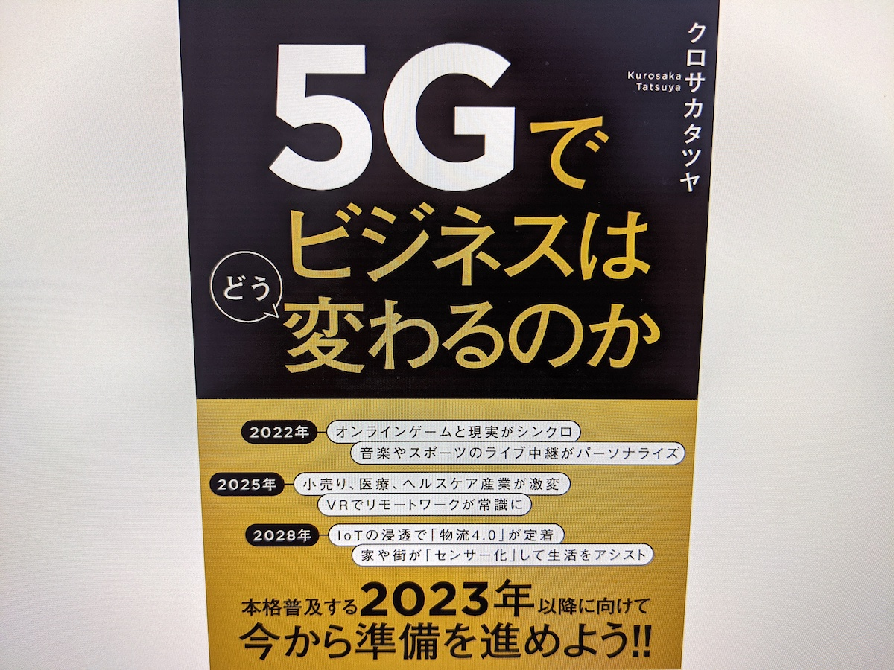

+++
date = "2019-11-30T16:00:00+09:00"
title = "書籍「5Gでビジネスはどう変わるのか」を読みました"
description = "第 5 世代移動通信システム、通称「5G」について学びたくて読んだ一冊の記録です。"
slug = "how-5g-will-change-business"
og_image = "2019/11/30/how-5g-will-change-business/thumbnail.jpg"
draft = false
+++

先日参加した会社の合宿の中で「5G」について話す機会があったのですが、そういや自分はあんまりわかっていないな〜と自覚したのでとりあえず書籍を 1 冊くらいは読んでおこうと思いました。ちょうどその合宿が開催されていた 2019 年 11 月 14 日に <a href="https://www.amazon.co.jp/dp/B0813HXK23/" title="5Gでビジネスはどう変わるのか | クロサカ タツヤ | ビジネス・経済 | Kindleストア | Amazon">5Gでビジネスはどう変わるのか</a> という書籍が発売されており、最新の情報を知れそうだと思って購入しました。

### まとめ

引用を交えての読書メモは長くなるので、先にまとめを書いておきます。

- 5G の特徴は 3 つ、筆記試験に出るよ
  - 超高速
  - 低遅延
  - 多数同時接続
- クロサカタツヤさんの考える普及タイムライン
  - (2017 〜 2019 年) 黎明期 + ピーク期
  - (2020 〜 2022 年) 幻滅期
  - (2023 〜 2025 年) 啓蒙活動期
  - (2026 〜 2030 年) 安定期
- まずは「ゲーム」と「動画配信」から
- スマートタウン
  - 日本中どこにいても、いまの自宅の Wi-FI より高速なネットワークを簡単に使える状況をベースとした街づくり
- 通信事業者は大きな変化を迫られる
  - この変化に乗れるプレイヤーと乗れないプレイヤー
  - 現在のいわゆる「三大キャリア」みたいなやつ、2030 年までに業界地図が変わっていそう
- 今後の各種事業
  - ゲーム配信
  - 動画配信
  - ライブ中継
  - テレビ番組の再配信
  - ゲーミフィケーション
  - スマートホーム、スマートシティ、スマートファクトリー
  - MaaS
- 社会課題の 5G 時代、ビジネスモデルとプライバシー
  - 受益者による直接課金モデルだけじゃなく、社会保障っぽい分散負担モデル
  - データが取れすぎてしまう、適切に扱うのがとてもむつかしい

5G だけのお話だけじゃなく、高度な AI や、高度な医療、高度なシステム全般について、人間がボトルネックになることがどんどん増えていくだろうな〜と感じました。テクノロジの進化によって、できることの領域がどんどん広がっていきます。完全に 5G が普及しきった 2030 年のことを想像してみると、自分が 2019 年のテクノロジをベースに「こんなのがあったらいいなあ」と思い描くようなことはだいたい「技術的には実現可能」になっていることでしょう。

だけれども実際には、ゼロから 2030 年の都市や街を設定して実装することはできず、既存のあれこれは大事にしながらそこに向かっていくことになります。ぼくらの無理解が進歩を遅らせることもあれば、変化を望まない人々によってなにかが後退することすらあります。

そんな中で新旧のバランスを取りながら、次の 10 年を楽しく生きていけるように、いい感じのポジションにつきたいなぁと思いました。やばい、5G のお話が壮大すぎるもんだから、テクノロジ社会に対するぼんやりとしたまとめになりました。

5G、完全に理解した。

### 読書メモ

読書中にハイライトした箇所は 116 個。

>５Ｇの「Ｇ」は、 10 年を一つの区切りとしたジェネレーションを意味します。ここから始まる 10 年間で、これまでになかったような５Ｇサービスが花開くことで、私たちの生活は豊かになり、それを支えるビジネスこそが日本経済を活性化します。そして５Ｇは、単なる通信規格の世代交代ではなく、デジタル・トランスフォーメーションが本格化する起点にもなるでしょう。その影響は２０３０年以降の６Ｇ（あるいはさらにその次の世代）にも連綿と続いていきます。

「G」ってジェネレーションだったのか。3G と 4G にお世話になりまくっていながら、そこからわかっていなかった。

>５Ｇの技術的な特徴として「超高速、低遅延、多数同時接続」が挙げられます。これは５Ｇの規格を標準化する際に定められたゴールで、いわば５Ｇを名乗るために必要な要件です（図１－１）。

「超高速、低遅延、多数同時接続」の 3 つ。筆記試験に出そう。基礎から学んでいくぞ。

>実際にはこれほどスマートフォンを使わないので、多数同時接続はＩｏＴ（モノのインターネット）機器の利用を促すことになるでしょう。単純計算なのであくまで概念的な想定ですが、一人あたり２０００個のセンサーが、私たち一人ひとりの健康や生活情報を追いかけるようになります。５Ｇ時代は人間がセンサーネットワークに包み込まれるようになり、スマートフォンのユーザー体験をはるかに超えた多様で濃密なデジタル・トランスフォーメーションが進むという未来が想像できます。

これはイメージ通りだな。本格的な IoT の時代というイメージはある。

>もう一つのモバイルエッジコンピューティング（以下、ＭＥＣ）は、ユーザーをはじめとしたデータエンティティ（データの元となる物理的な存在）のできるだけ近くで、データ分析などの処理を行うことを指します。現在のデータ処理は、前述したＡＷＳのようなクラウドコンピューティングを用いで行うのが主流となっています。一方でＭＥＣでは、基地局のすぐそば（つまりデータエンティティに近接した場所）にコンピュータを設置し、そこで必要なデータを処理することで、より高速かつ簡潔な処理を可能とします。

エッジコンピューティングだ。これも 5G と絡んでくるのだなあ。

>フルコネクテッドが必要なのは、ビル（ビルディングオートメーション）や街（スマートシティ）の管理といった用途だけではありません。リアルタイム、オンデマンド、最適化。それらの実現には、高品質なネットワークが必要です。そして、そうしたニーズに応えるべく作られたのが５Ｇなのです。

フルコネクテッドの考え方、ぼくは好き。ぼく自身もどんどんネットワークにつながれていきたい。

>こうした「いつでもどこでもコンピューティング」が実現すると、物理空間やコミュニティの最適化が促されます。これまでの４Ｇがサイバー空間における特定ユーザーのための通信環境だったのに対して、５Ｇは物理空間やコミュニティを共有するあらゆる人たちのための通信環境になっていくのです。それによって従来になかった事業機会が生まれるのも確かです。

意識せずとも活用するようになっていく。通信が、ますます水道・電気・ガスのような存在になっていきそう。

>このように、サイバースペース上でフィジカルスペース（物理空間）の情報を正確に再現することを、「デジタルツイン」と言います。デジタル化によって生み出される擬似的な双子、とでも言えばいいでしょうか。ファクトリーオートメーション（工場の制御・管理）やサプライチェーンマネジメント（物流や在庫などの制御・管理）など、モノづくりの世界で意識されている概念で、サイバースペース上でのシミュレーションを前提としたビジネスプロセスの変革手法として注目を集めています。

「デジタルツイン」って語彙は知らなかった。Wikipedia にも項目があった。

<a href="https://en.wikipedia.org/wiki/Digital_twin" title="Digital twin - Wikipedia">Digital twin - Wikipedia</a>

>ともあれ、サイバースペースとフィジカルスペースの垣根がなくなり、リアルとバーチャルの境目も消失することで、すべてがシームレスになっていくのは大きなトレンドとして間違いありません。その結果として、デジタルも含めたすべてがリアル、という世界が５Ｇによって訪れます。

コンセプトはすでにあるし、そういった世界観に身を投じている人もいるけれど、5G というインフラによって浸透がさらに進むってことか。

>既存の前提条件があまりにも強固なものである場合、どうしても先入観や固定観念が形成されます。コネクテッドＴＶであれば、ユーザーが「テレビは地上波のもの」と考えていることが固定概念であり、ネットワーク接続によって新たなサービスを提供したいと考えるイノベーターにとってはこうした認識が普及の障害となります。

めっちゃあると思う。自分も 3G や 4G の体験を経て今の意識が形成されている人間なので、新しいことを考える上でそれらに引っ張られないようにしなきゃいけないだろうな。

>この 10 年で進展したスマートフォンの普及とアプリエコノミーの台頭は、私たちにあまりにも鮮烈な印象を残し、なおかつ私たちは日々依存を強めています。それゆえに、窓を前提としない環境やパラダイムが、理解しづらくなっているのです。

ここでいう「窓」ってのはインターフェイスとしての「画面」のこと。書籍『さよなら、インタフェース』のことを思い出す。

<a href="https://june29.jp/2016/08/06/the-best-interface-is-no-interface/" title="書籍「さよなら、インタフェース」を読んだ - #june29jp">書籍「さよなら、インタフェース」を読んだ - #june29jp</a>

>では、５Ｇにとっての「旬の時期」となる２０２０～２０３０年に、５Ｇはどのような形で普及していくのでしょうか。ここでは、技術が普及していくまでの流れを予想するフレームワークとして、ガートナー社が提唱する「ハイプ・サイクル」に沿って説明していくことにします。

「ハイプ・サイクル」ってのがあるんですね。図を見ると「完全理解曲線じゃん」となってしまう。

<a href="https://ja.wikipedia.org/wiki/%E3%83%8F%E3%82%A4%E3%83%97%E3%83%BB%E3%82%B5%E3%82%A4%E3%82%AF%E3%83%AB" title="ハイプ・サイクル - Wikipedia">ハイプ・サイクル - Wikipedia</a>

>こうして「予測前提の社会」を実現する上で、ＡＩが頭脳だとすれば、ＩｏＴ機器が感覚器、５Ｇは神経系の役割を果たします。

きれいな整理。わかりやすい。

>インフラの拡充という視点で考えてみても、コネクテッドカーやＭａａＳは興味深い存在です。すでにトヨタ自動車が「ｅパレット」というコンセプトを発表していますが、通信という観点からも、クルマは単なる端末ではなく、近隣住民へコネクティビティを提供する基地局になっているという構想もあります。プラグインハイブリッドカーは自宅の電源代わりとしても使えるようになっており、さらに用途を広げてご近所へのコネクティビティ供給源に発展するかもしれない、ということです。

これおもしろいな〜。書籍『人口減少社会のデザイン』でドイツの「自動車を前提としない街づくり」の例を知って、わりと自動車ありきで街づくりをしてきた日本はどうするといいんだろう、と思っていたけれど。5G よりもっと先の 6G か 7G が普及するであろう 2040 年くらいをターゲットに、自動車を街の API のひとつしてめちゃくちゃ気軽に使えるような状態を想像してみると、ぼくが今まで考えたこともなかったような街のデザインが成立しそう。

>しかし筆者は、もう少し踏み込んだ双方向のユーザー体験が実現できるのではないかと考えています。例えば、ひいきの選手が外野に飛んだ難しい球をダイビングキャッチする。あるいは、たまたま見たプロゴルファーが試合でホールインワンを達成する。こういう瞬間に「ナイスプレイ！」とメッセージを送ることもできるはずですし、少額でも「ご祝儀」を渡せたら、スポーツ観戦の体験はもちろんスポーツビジネスもこれまでと違うものになるのではないでしょうか。

スポーツの楽しみ方も変わるかもしれませんな。音楽アーティストの変化を追っていくような感じになるのかな。

>５Ｇが直接関係する形でのテレビの再送信で注目されるタイミングは、２０２３年です。５Ｇの啓蒙活動期が始まるタイミングであり、ＳＡによる本格的な５Ｇ環境の普及も始まります。それと同時に、放送局の再免許の年にもあたります（有効期間は５年）。２０２８年ごろまでを現状の放送産業の体制で迎えるのか、本格的な５Ｇ環境の普及を見越して新たな事業者の参入も視野に入れて検討を進めるのかが、大きな分かれ目となります。

へぇ〜、そういう要素もあるのだなあ。

>アドレッサブル広告とは、ユーザーの行動に最適化するインターネット広告の手法を、動画配信やテレビに持ち込もうとするものです。この手法でないと、例えば山陰地方のテレビ局が制作した番組を北海道で視聴する際、番組に付帯する山陰地方向けのテレビＣＭを見ることになりかねません。それはそれで情緒がありそうですが、商売という意味では北海道向けのＣＭが放映されるべきでしょう。アドレッサブル広告によって、ユーザーの地域性や個別の関心に基づく広告配信を実現でき、こうした課題を解消できるかもしれません。

「アドレッサブル広告」というのを知った。このへんは、そもそもの広告自体が今後どうなっていくか次第なんじゃないかな、という印象。現行の「テレビ番組の合間に差し込む映像広告」のことはいったん忘れて、ゼロから考えが方がかっこいいものになるんじゃないかな、と素人考えで思っている。広告業界のことはぜんぜん知らずに言っている。

>さらに、地域に暮らす住民は、その地域の原動力であり、住民はできるだけ健康であることが地域活性化の観点からも期待されます。単なるエネルギーやモビリティの改善だけでなく、住民一人ひとりの健康改善のために、移動の際に積極的に歩いてくれた人をポイントなどで優遇するような方法で、社会保障の効率を高めるためのスマートシティもあり得るでしょう。

健康ボーナスはとても興味がある。

>ローカル５Ｇとは、企業や自治体の施設などに導入できる「自営の５Ｇ通信」です。建物や土地といった単位で区切られた限定エリアで、屋内で利用するという条件の下で免許の交付が予定されており、実現すると５Ｇを自営無線通信の手段として利用できます。

ローカル 5G のこと、知らなかった。

>その際、ユーザーが自ら免許を取得するだけでなく、システムインテグレーターやＣＡＴＶ事業者などに免許取得を代行させて、彼らが提供するシステムを利用することも可能です。また、大手モバイル通信事業者には免許が与えられないという制限も課されています。これは、５Ｇに従来とは異なる新たなプレーヤーを呼び込み、一層活性化させたいという総務省の意図によるものです。

総務省さん、おもしろい制限をかけている。

>５Ｇを使ったサービスを設計し、それを事業として継続・拡大させる時、筆者が最も重要だと考えるのは体験の設計（エクスペリエンス・デザイン）です。

インターフェイスが「画面」じゃない領域が広がるから、そうなるよなあ。「リングフィット アドベンチャー」は参考になりそう。

>ゲーミフィケーションやナッジを実現する技術的なアプローチとして重要なのが「プリフェッチ」です。元はＷｅｂサービスを開発する技術の一つで、ユーザーの行動を先回りしてシステムを最適化するというものです。例えばスマートフォンで「レストラン」と検索した時、ユーザーは検索エンジンに「レストラン」という言葉（クエリー）しか入力していないのに、なぜか自分の現在地に近いレストランが出てきます。しかも、夕方であればディナー用のお店を、昼前後であればランチに適したレストランを検索結果として表示します。このように、スマートフォン時代の検索エンジンが、入力される言葉だけでなく、位置情報や時間の情報、さらには同一アカウントやそれに似たタイプの人の直近の検索履歴などを参考にしているからです。

後半の話はプリフェッチではないと思った。書籍全体の中で、ここだけは「ちがくない？」と思いながら読んだ。「考慮の材料を増やす」のは量の話で「先読み (プリフェッチ) する」のは時系列の話だと思う。

>これをビジネスモデルに置き換えてみると、例えばサブスクリプションによるサービス提供は、おそらく４Ｇサービスが成熟した向こう１～２年がピークで、その先は少しずつ選ばれなくなっていくでしょう。現時点ではなじみのある課金の方法ですが、すでにユーザーは「拘束されている」という感覚を持っているはずですから、一度反旗を翻されると、ユーザー離れは早いかもしれません。

おっ、サブスク衰退論だ。世の中的にはまだまだ「これからはサブスクだ〜！」っていう空気があるように感じるから、今の時点で「少しずつ選ばれなくなっていくでしょう」と論じるのおもしろいな〜。未来を見るのが楽しみ。

>これを実現するには、サービス提供の中でトライアンドエラーを繰り返すことが必要です。従って５Ｇサービスは、現在ソフトウェアの開発・運用手法として定着し始めているDevOps（デブオプス）、すなわち「開発しながら運用し、運用のフィードバックを開発に活かす」というアプローチが、これまで以上に重要になります。

突然の DevOps だ。ぼくも同感です。これまで以上に重要になっていくと考えている。

### 書籍の情報はこちら

<a href="http://www.amazon.co.jp/exec/obidos/ASIN/B0813HXK23/cameralady-22/">5Gでビジネスはどう変わるのか</a>
<ul><li>作者: クロサカ<a class="keyword" href="http://d.hatena.ne.jp/keyword/%A5%BF%A5%C4">タツ</a>ヤ</li><li>出版社/メーカー: <a class="keyword" href="http://d.hatena.ne.jp/keyword/%C6%FC%B7%D0BP">日経BP</a></li><li>発売日: 2019/11/14</li><li>メディア: <a class="keyword" href="http://d.hatena.ne.jp/keyword/Kindle">Kindle</a>版</li></ul>

