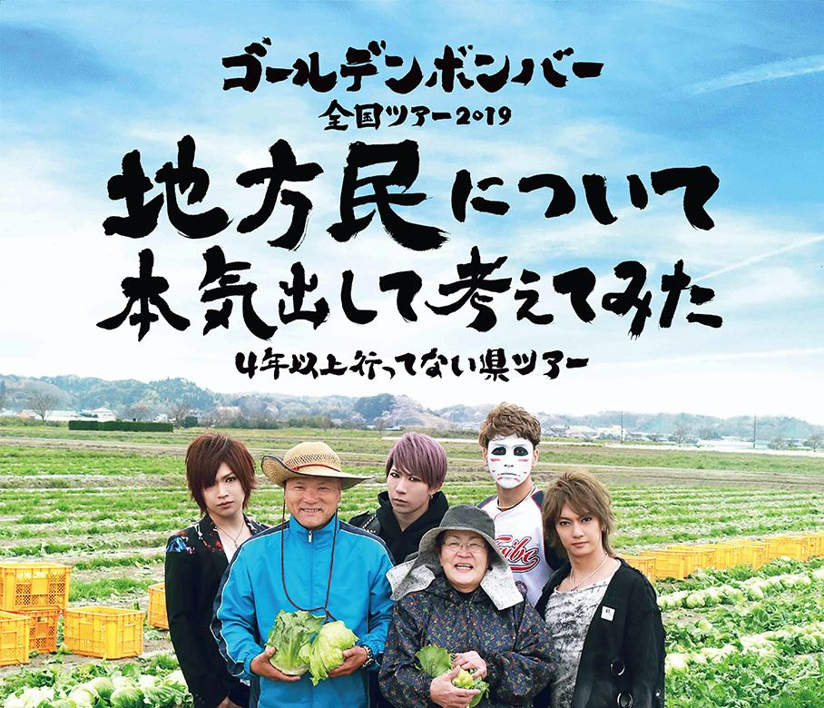
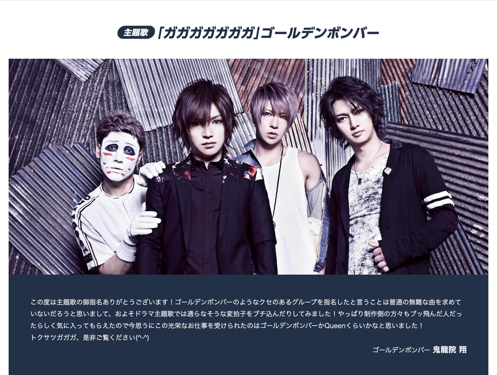

+++
date = "2019-12-22T14:00:00+09:00"
title = "令和元年のゴールデンボンバーとわたし"
description = "今年はゴールデンボンバーのライブに初参戦したりと、楽しい 1 年でした。"
slug = "goldenbomber-and-me-in-reiwa-1st"
og_image = "2019/12/22/goldenbomber-and-me-in-reiwa-1st/reiwa.jpg"
draft = false
+++

わたしが最初にゴールデンボンバーを認知したのはいつなのか、それは定かではないのだけれど。おそらく約 10 年ほど前に知ったのだろうと解釈しています。最古の言及ツイートはこれ。

<blockquote class="twitter-tweet">
<a href="https://twitter.com/hashtag/hmskmt?src=hash&amp;ref_src=twsrc%5Etfw">#hmskmt</a> の公式 BGM はゴールデンボンバーの曲です！
&mdash; Jun OHWADA (@june29) <a href="https://twitter.com/june29/status/9047211777?ref_src=twsrc%5Etfw">February 13, 2010</a></blockquote>

2010 年 2 月の時点で、友人たちとワイワイするイベントの BGM にゴールデンボンバーの曲をゴリ推ししているので、少なくともこのときにはすでにドハマリしているのだと思います。そこから逆算すると、2010 年 1 月か、2009 年 12 月くらいにゴールデンボンバーと出会っていると考えられます。

というわけで、まるまる 10 年間くらいファンをやってきたことになりますか。そんなわたし、2019 年はゴールデンボンバーのライブに初参戦したりもして、例年以上に思い出深い今年になりましたので、あれこれ書いてみようと思います。

### 令和

筆頭トピックは、やはりこれですかね。曲とミュージックビデオのほとんどの部分を事前につくっておいて、新元号が発表されたらすぐに空白部分に当て込んで完成させる、という取り組みでおおいに注目されました。曲の完成度も高くてよかった。

<iframe width="560" height="315" src="https://www.youtube.com/embed/VeUQk7O-1E4" frameborder="0" allow="accelerometer; autoplay; encrypted-media; gyroscope; picture-in-picture" allowfullscreen></iframe>

- <a href="https://realsound.jp/2019/04/post-341690.html" title="ゴールデンボンバー、“新元号ソング”「令和」最速リリース　生配信から滲んだバンドの姿勢 - Real Sound｜リアルサウンド">ゴールデンボンバー、“新元号ソング”「令和」最速リリース - Real Sound｜リアルサウンド</a>
- <a href="https://natalie.mu/music/news/326217" title="ゴールデンボンバー、新元号ソング「令和」を猛スピードで完成させる（動画あり） - 音楽ナタリー">ゴールデンボンバー、新元号ソング「令和」を猛スピードで完成させる（動画あり） - 音楽ナタリー</a>
- <a href="https://dot.asahi.com/dot/2019040500051.html" title="ゴールデンボンバー　新曲「令和」に見た本物感 (1/3) 〈dot.〉｜AERA dot. (アエラドット)">ゴールデンボンバー　新曲「令和」に見た本物感 (1/3) 〈dot.〉｜AERA dot. (アエラドット)</a>

わたしもこの曲『令和』は大好きで、ミュージックビデオを見ながらいっしょに令和ダンスを踊りました。そしてだんだんと、令和元年の全国ツアーに参戦して、メンバーの 4 人やたくさんのファンたちといっしょに、この「れ・い・わ！」を踊りたいと思うようになったのです。

### 全国ツアー 2019

今年のツアータイトルは「地方民について本気出して考えてみた～４年以上行ってない県ツアー～」でした。わたしも北海道出身者なので、こうして地方にスポットをあててもらえるのはうれしいものです。実際に、北海道は広いので近い地域に住む人にしかわからないであろう「中標津町総合文化会館 しるべっとホール」「北斗市総合文化センター かなで～る」「小樽市民会館」といった場所に、ゴールデンボンバーおよびツアースタッフのみなさんが足を運んでくれました。ありがとうございます。

わたしは、というと。今は都内在住なので、ぜんぜん地方っぽくない「横浜アリーナ」の回に参戦しました。感想は Scrapbox に書きました。

<a href="https://scrapbox.io/june29/%E3%82%B4%E3%83%BC%E3%83%AB%E3%83%87%E3%83%B3%E3%83%9C%E3%83%B3%E3%83%90%E3%83%BC%E5%85%A8%E5%9B%BD%E3%83%84%E3%82%A2%E3%83%BC2019" title="ゴールデンボンバー全国ツアー2019 - june29">ゴールデンボンバー全国ツアー2019 - june29</a>

もともと「現地で見たい」という欲はぜんぜんなくて、初参戦を終えた今でもそれは変わらずではあるものの。新時代の令和をきっかけに「ライブに行ってみる！」と思って行動に移せたのは本当によかったと思っています。めちゃくちゃ楽しかった。そのうち、自分が参加した回のライブが映像作品になった DVD が届きます。さらにもう一度あの興奮を味わえるのかと思うとワクワクしちゃいますね。

このライブの中で、配信直後だった『首が痛い』と、ここで発表となった『かまってちょうだい///』と、ふたつの新曲を楽しめたのもうれしかったです。どちらも大好きなテイストで、思い出とともにある大事な曲となりました。

<iframe width="560" height="315" src="https://www.youtube.com/embed/-7CuDlJqWrc" frameborder="0" allow="accelerometer; autoplay; encrypted-media; gyroscope; picture-in-picture" allowfullscreen></iframe>

<iframe width="560" height="315" src="https://www.youtube.com/embed/8k49syxQgng" frameborder="0" allow="accelerometer; autoplay; encrypted-media; gyroscope; picture-in-picture" allowfullscreen></iframe>

### トクサツガガガ

さて、カレンダーを年初まで戻して、次の話をしましょう。NHK にて 2019 年 1 月から 3 月まで放送されたテレビドラマ『トクサツガガガ』の主題歌をゴールデンボンバーが担当しました。曲名は『ガガガガガガガ』です。

<a href="https://www.nhk.or.jp/nagoya/gagaga/midokoro/" title="みどころ｜トクサツガガガ｜NHK ドラマ10">みどころ｜トクサツガガガ｜NHK ドラマ10</a> のページにも鬼龍院翔さんのコメントが掲載されています。

ミュージックビデオは特撮色を取り入れた楽しい仕上がり。特筆すべきは『トクサツガガガ』の世界観に見事に合わせた歌詞でしょう。ドラマ放送当時、<a href="https://www.jigowatt121.com/entry/2019/01/22/182924" title="社会人オタクよ、ゴールデンボンバーの新曲『ガガガガガガガ』を聴いてくれ - ジゴワットレポート">社会人オタクよ、ゴールデンボンバーの新曲『ガガガガガガガ』を聴いてくれ - ジゴワットレポート</a>というブログ記事にて絶賛されているのも見かけました。

<iframe width="560" height="315" src="https://www.youtube.com/embed/kkgCkBLHhHU" frameborder="0" allow="accelerometer; autoplay; encrypted-media; gyroscope; picture-in-picture" allowfullscreen></iframe>

ぼくはあまりテレビドラマは見ない生活なもので、実はドラマを鑑賞していた妻の方が、この曲へ強い思い入れを持っていたりします。今では夫婦で楽しめる曲となりました。

余談ですが、10 年来のファンとしては、ゴールデンボンバーと特撮の組み合わせとなると「精力戦隊オサセンジャー」を思い出しちゃいますね！最近の作品と比べると映像のクオリティが低すぎて笑っちゃいますが、やっていることはそこまで変わらないというのもおもしいろポイントです。

<iframe width="560" height="315" src="https://www.youtube.com/embed/0rKJfA7pxAs" frameborder="0" allow="accelerometer; autoplay; encrypted-media; gyroscope; picture-in-picture" allowfullscreen></iframe>

### 『女々しくて』 10 周年

<a href="https://ja.wikipedia.org/wiki/%E5%A5%B3%E3%80%85%E3%81%97%E3%81%8F%E3%81%A6" title="女々しくて - Wikipedia">女々しくて - Wikipedia</a>

>「女々しくて」（めめしくて）は、ゴールデンボンバーの7枚目のシングル。2009年10月21日にスクーデリア・ユークリッド（Zany Zapレーベル）から発売された。

なんと、2019 年 10 月 21 日で『女々しくて』の発売から丸 10 年だったのです。発売から国民的ヒットソングになるまでしばらく時間がかかるので、ほとんどの国民にとっては 10 年前の曲という感触はないと思います。

<iframe width="560" height="315" src="https://www.youtube.com/embed/vvepe04Dbh4" frameborder="0" allow="accelerometer; autoplay; encrypted-media; gyroscope; picture-in-picture" allowfullscreen></iframe>

このミュージックビデオのクオリティからすると『令和』なんかは「遠くにきたもんだなあ」と思わされるものがありますし、一方で、今でも最大のヒット曲は不動の『女々しくて』なので、この 10 年でまったく色褪せていないとも言えます。

鬼龍院翔さんの『女々しくて』との向き合い方は、ここ数年で大きく変わってきたように感じられます。テレビ出演が増えていた時期には「女々しくての呪い」と言ったりしていて、次のヒット曲を出さなきゃ出さなきゃと焦って苦しそうにしている印象がありました。いつからか、そういう重たいオーラは見えなくなった気がします。最近はテレビ出演の回数も落ち着いてきていて、先述した『首が痛い』『かまってちょうだい///』のように「ライブで盛り上がる」「ライブに特化してつくられている」系の作品に力を入れているのではないでしょうか。

2020 年はどの方向に伸びていくのか、今から楽しみです！

### NHK 紅白歌合戦

2019 年の大晦日に放送される <a href="https://www.nhk.or.jp/kouhaku/" title="第70回NHK紅白歌合戦">第70回NHK紅白歌合戦</a> の出場歌手の一覧に、ゴールデンボンバーの名前はありませんでした。

この事実を逆手に取るように、ニューアルバム『もう紅白に出してくれない』が発表されました。わざわざ偽のニュースサイトまでつくって告知するのだから、転んでもタダでは起きないというか、なんでも話題に変えていく芯の強さを感じます。

<a href="https://news.yah000.jp/pickup/20191114800.html" title="金爆、新アルバムタイトルは「もう紅白に出してくれない」（音楽ナタソー） - 卍!ニュース">金爆、新アルバムタイトルは「もう紅白に出してくれない」（音楽ナタソー） - 卍!ニュース</a>

<a href="https://www.amazon.co.jp/exec/obidos/ASIN/B07ZWBD836/cameralady-22/">もう紅白に出してくれない(CD+DVD)</a>
<ul><li>アーティスト:ゴールデンボンバー</li><li>出版社/メーカー: Zany Zap</li><li>発売日: 2019/12/28</li><li>メディア: CD</li></ul>

ORICON NEWS のインタビュー記事には、こんな記述もありました。

<a href="https://www.oricon.co.jp/special/54095/" title="“紅白落選”もエンタメ化する、「ギリギリアウトを攻める」ゴールデンボンバー・鬼龍院翔の矜持 | ORICON NEWS">“紅白落選”もエンタメ化する、「ギリギリアウトを攻める」ゴールデンボンバー・鬼龍院翔の矜持 | ORICON NEWS</a>

>事務所やスタッフは「今年は出られるんじゃないか」と期待していて、僕らも応えられるように頑張ったんですけど、こういう結果に（笑）。それでこのタイトルにして自虐したんですが、僕自身はこういう生き方が好きなんですよね。あとやっぱり、僕らが落ち込んでないことをファンに知らせるために、全力でふざけた部分はあります。心配されてしまうと笑えなくなる。心配は笑いの“毒”なんですよ。

わたしも 2019 年は紅白に出場できると予想していたひとりです。歌うのは『令和』で。この『令和』に関しては、出演できるとしたら令和元年の今年しかないでしょうから。ゴールデンボンバーと NHK のつながりという意味では『ガガガガガガガ』もあります。何度か『NHKのど自慢』にも出演していました。わたしが思うに、NHK から見ても今年のゴールデンボンバーは番組の中で非常に使いやすい駒ではあるでしょう。

実は、今この時点においても、わたしは「ゴールデンボンバーは今年の紅白になんらかの形で出演する」と思っています。『トクサツガガガ』に絡めた余興のコーナーあたりでサプライズ的に登場して、そのままの勢いで『令和』も歌っちゃうんじゃないか。そんな淡い期待をここに書いて予言ということにしながら、ゴールデンボンバーとわたしの令和元年のふりかえりを締めたいと思います。

ただ、裏番組の『SASUKE2019』に樽美酒研二さんが出演するとのことなんですよね… さてさて、どうなることやら。ちなみに喜矢武豊さんの出演情報は見当たりませんでした。今回はソロかしら？

<a href="http://pc.goldenbomber.jp/contents/280962" title="12/31(火)19:00〜23:55 - TBS「SASUKE2019」※樽美酒研二 出演 | ゴールデンボンバー Official WebSite">12/31(火)19:00〜23:55 - TBS「SASUKE2019」※樽美酒研二 出演 | ゴールデンボンバー Official WebSite</a>

### おわりに

<a href="https://adventar.org/calendars/4165" title="2019 Advent Calendar 2019 - Adventar">2019 Advent Calendar 2019 - Adventar</a> の 22 日の担当記事でした。きのう 21 日は <a href="https://twitter.com/xkxaxkx" title="kak (@xKxAxKx) / Twitter">@xKxAxKx</a> さんによる <a href="https://xkxaxkx.hatenablog.com/entry/2019/12/21/201137" title="2019 is goes on - K Diary">2019 is goes on - K Diary</a> で、明日 23 日は <a href="https://medium.com/@conveniitekuru" title="コンビニ行ってくる – Medium">@conveniitekuru</a> さんによるナニカです。

それではまた、2020 年の Advent Calendar でお会いしましょう！
