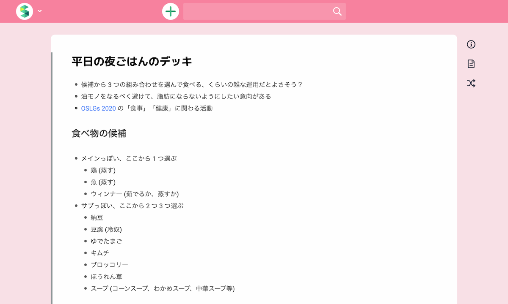
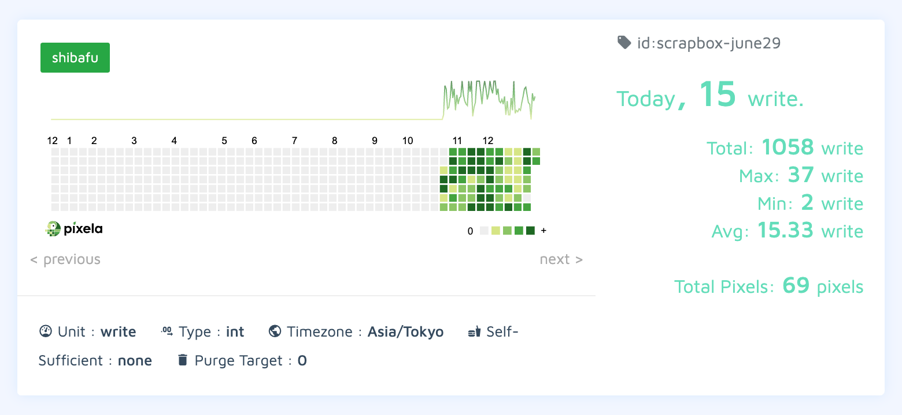
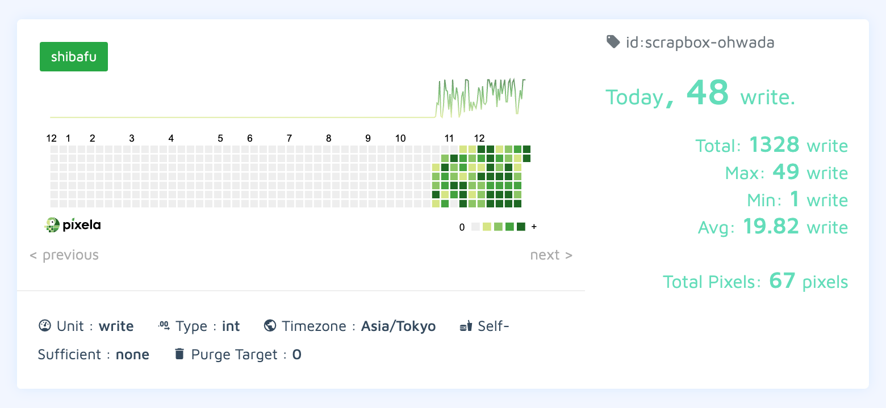
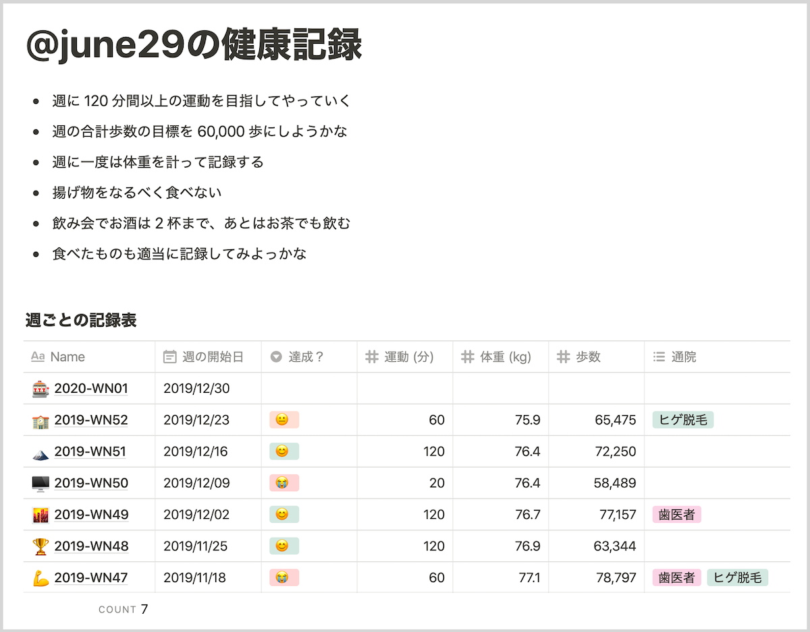

+++
date = "2019-12-30T0:00:00+09:00"
title = "楽しかった 2019 年"
description = "なんとびっくり 2019 年が終わっていくというのでふりかえりです。"
slug = "lovely-2019"
og_image = "2019/12/30/lovely-2019/2019.png"
draft = false
+++

### はじめに

29 日に家庭での「ふりかえり 2019」を実施しまして、あれこれ収穫できたので、そのうちの自分の分をここにスナップショットとして記録しておきましょう。今年も楽しい 1 年でしたね。また最高記録を更新できたと思います。

### 健康

- ジム
- リングフィット アドベンチャー
- 食生活の改善

年初にフィットネスジムに入会して、週 1 〜 2 のペースで通い続けた 1 年でした。生活がばたばたと忙しくなってしまうとジムに行けない週が生じてしまったりもするので、スケジューリングからやっていかねばなりませんな。Nintendo Switch の「リングフィット アドベンチャー」も、想像していた以上にがっつり運動できておもしろかったです。

11 月下旬にいきなり思い立って、自家用 Scrapbox に「平日の夜ごはんのデッキ」というページをつくり、そこから食生活が改善されて体重が減り始めました。この生活を続けたらもうしばらくは減量が続くんじゃないかと思います。来年も今の感じでやっていきます。

### 通院

- 歯医者
  - 虫歯を治してもらって、その後は定期的に歯科衛生士さんのところに行ってあれこれメンテナンスしている
- ヒゲ脱毛
  - <a href="https://june29.jp/2019/03/20/facial-hair-removal/" title="ソフトウェアエンジニアがヒゲ脱毛を体験してみた - #june29jp">ソフトウェアエンジニアがヒゲ脱毛を体験してみた - #june29jp</a>
  - <a href="https://scrapbox.io/june29/%E3%83%92%E3%82%B2%E3%81%AE%E5%8C%BB%E7%99%82%E8%84%B1%E6%AF%9B" title="ヒゲの医療脱毛 - june29">ヒゲの医療脱毛 - Scrapbox</a>

ヒゲ、まだ根絶が完了していないのであと何回かレーザーを浴びに行くと思います。「もうぜんぜん生えてこなくなったな〜」というところまで進捗が出たら、またここに記事を書いて報告するつもりです。

### 地方都市

- 夏の北海道滞在
  - <a href="https://june29.jp/2019/08/11/staying-in-hokkaido-2019-summer/" title="北海道で3週間ほど過ごした2019年の夏 - #june29jp">北海道で3週間ほど過ごした2019年の夏 - #june29jp</a>
- 福岡市への興味

夏に釧路と札幌で過ごした「北海道滞在」が、とにかくよかったです。帰ってきてから妻とふりかえりをして、そこで見つけた Try をひたすら拾って可能性をどんどん広げていったのが 2019 年の後半戦と言えます。

地方都市にすごく魅力を感じていて、2020 年の夏も北海道滞在をやっていくつもりですし、福岡滞在にも挑戦してみたいな〜と思っています。百道浜と室見川には必ず行かなきゃなあ！

### 読書

定常的なにかしらの本を読んで楽しみながら過ごしていたと思います。特に「読めてよかった！」というのは下記。

- <a href="https://june29.jp/2019/01/22/factfulness/" title="書籍「ファクトフルネス」を読みました - #june29jp">書籍「ファクトフルネス」を読みました - #june29jp</a>
- <a href="https://june29.jp/2019/05/02/picsy-divicracy-constituent-social-contract/" title="書籍「なめらかな社会とその敵」を読みました - #june29jp">書籍「なめらかな社会とその敵」を読みました - #june29jp</a>
- <a href="https://june29.jp/2019/10/13/the-mayor-of-fukuoka-city/" title="書籍「福岡市を経営する」を読みました - #june29jp">書籍「福岡市を経営する」を読みました - #june29jp</a>
- <a href="https://june29.jp/2019/10/14/designing-a-society-with-a-declining-population/" title="書籍「人口減少社会のデザイン」を読みました - #june29jp">書籍「人口減少社会のデザイン」を読みました - #june29jp</a>
- <a href="https://june29.jp/2019/11/17/a-chance-to-win-of-the-japanese-people/" title="書籍「日本人の勝算」を読みました - #june29jp">書籍「日本人の勝算」を読みました - #june29jp</a>

### 漫画

Scrapbox に <a href="https://scrapbox.io/june29/%E8%AA%AD%E3%82%93%E3%81%A0%E6%BC%AB%E7%94%BB_2019" title="読んだ漫画 2019 - june29">読んだ漫画 2019</a> というページをつくりました。こちらには概要だけを載せましょう。

約 100 作品について、コミックスの新刊が出るたびに Kindle で購入して読んでいました。「読んでいて感情を揺さぶられたぜ」で 10 作品を選ぶとこんな感じです。

- <a href="https://www.amazon.co.jp/gp/product/B07ZRRZQX5/ref=as_li_tl?ie=UTF8&tag=cameralady-22&camp=247&creative=1211&linkCode=as2&creativeASIN=B07ZRRZQX5&linkId=3478bce06a61a44798cf43c4c21a1b3e">アオアシ</a>
- <a href="https://www.amazon.co.jp/gp/product/B081B2KM81/ref=as_li_tl?ie=UTF8&tag=cameralady-22&camp=247&creative=1211&linkCode=as2&creativeASIN=B081B2KM81&linkId=10d4580efe575e3823664694c7ccb2aa">イムリ</a>
- <a href="https://www.amazon.co.jp/gp/product/B07D56YM2Y/ref=as_li_tl?ie=UTF8&tag=cameralady-22&camp=247&creative=1211&linkCode=as2&creativeASIN=B07D56YM2Y&linkId=cc9a3170bf6615a9866a58cc8e19f21a">キングダム</a>
- <a href="https://www.amazon.co.jp/gp/product/B0832ZVBTX/ref=as_li_tl?ie=UTF8&tag=cameralady-22&camp=247&creative=1211&linkCode=as2&creativeASIN=B0832ZVBTX&linkId=957c75b76a52bd737880f832ee47822a">テセウスの船</a>
- <a href="https://www.amazon.co.jp/gp/product/B081VMK7PC/ref=as_li_tl?ie=UTF8&tag=cameralady-22&camp=247&creative=1211&linkCode=as2&creativeASIN=B081VMK7PC&linkId=a91a4969b8c162a2c005ce918aaed6cb">とんがり帽子のアトリエ</a>
- <a href="https://www.amazon.co.jp/gp/product/B081Y76NQ1/ref=as_li_tl?ie=UTF8&tag=cameralady-22&camp=247&creative=1211&linkCode=as2&creativeASIN=B081Y76NQ1&linkId=4029b06d5edb3c7f79db6e92d52949fa">ブルーピリオド</a>
- <a href="https://www.amazon.co.jp/gp/product/B081ZBX4FC/ref=as_li_tl?ie=UTF8&tag=cameralady-22&camp=247&creative=1211&linkCode=as2&creativeASIN=B081ZBX4FC&linkId=c76ede050288e7d113ba4077dbb3a6b2">ほしとんで</a>
- <a href="https://www.amazon.co.jp/gp/product/B0814Y5BDV/ref=as_li_tl?ie=UTF8&tag=cameralady-22&camp=247&creative=1211&linkCode=as2&creativeASIN=B0814Y5BDV&linkId=afd0450399d56aa0904dbbace5f21a5c">亜人</a>
- <a href="https://www.amazon.co.jp/gp/product/B07YQVJ91Z/ref=as_li_tl?ie=UTF8&tag=cameralady-22&camp=247&creative=1211&linkCode=as2&creativeASIN=B07YQVJ91Z&linkId=fb001da548620b8cb46eb5ea2fae9154">呪術廻戦</a>
- <a href="https://www.amazon.co.jp/gp/product/B07S75JMGF/ref=as_li_tl?ie=UTF8&tag=cameralady-22&camp=247&creative=1211&linkCode=as2&creativeASIN=B07S75JMGF&linkId=5f7225285a95fef1db1e8cd5b3acc91d">青野くんに触りたいから死にたい</a>

すべて Kindle で既刊をまとめ買いするためのリンクになっているので、ついうっかり沼に落ちないようにご注意くださいね？

### ブログ

- 今回のこれを含めて 27 記事
- 7 月は記事がなかったけれど、それ以外の月は書けている

### 大和田◯◯会議

- 大和田防災会議
  - <a href="https://june29.jp/2019/10/13/disaster-prevention-meeting-2019/" title="大和田防災会議 2019 を開催しました - #june29jp">大和田防災会議 2019 を開催しました - #june29jp</a>
- 大和田みらい会議
- 大和田ダボス会議

大和田家においてなにか解決したい問題が見つかったとき、キャッチーな名前をつけた会議を開催して、対話と知恵によって問題を解決するという習慣が定着したのが今年と言えそうです。けっこう「手強い問題」も正面から向き合って解決のために動けるようになってきた感触があります。ときにはしんどい話題に波及することもあるけれど、それでも。対話の先によりよい未来があると信じて、短絡的に感情的にならずに会議を進行できるようになってきました。

### YouTube、Netflix

YouTube や Netflix の映像コンテンツを楽しむ時間が去年の数倍になり、一方でテレビ番組を見る時間はどんどん短かくなっていきました。遅まきながら、インターネット経由での映像が我が家にもたくさん流れ込んできた年でした。

### 動画撮影

- GoPro HERO7 Black
- Game Capture HD60 S+

上記を導入したことで「生活の様子」と「ゲームプレイの様子」を動画として記録する行動体系が生じました。生成された動画コンテンツの実例を以下に紹介します。

<iframe width="560" height="315" src="https://www.youtube.com/embed/PZ40DtPlUa4" frameborder="0" allow="accelerometer; autoplay; encrypted-media; gyroscope; picture-in-picture" allowfullscreen></iframe>

<iframe width="560" height="315" src="https://www.youtube.com/embed/6uNjCsUBA_E" frameborder="0" allow="accelerometer; autoplay; encrypted-media; gyroscope; picture-in-picture" allowfullscreen></iframe>

### Scrapbox

- 自分用 Scrapbox
- 自家用 Scrapbox

自分用の Scrapbox は去年にはセットアップしてあったものの、本格的に活用できたのは今年ですね。特に「日記」を書けるようになったのは大きいです。自分の人生が、精神レベルでは大きく変わりました。

<a href="https://june29.jp/2019/09/23/daily-diary/" title="人生で初めて「日記」や「日報」を書く習慣が定着したかもしれない - #june29jp">人生で初めて「日記」や「日報」を書く習慣が定着したかもしれない - #june29jp</a>

それ以上に大きな変化を生んだのがゴールデンウィークにセットアップした自家用 Scrapbox の方で、導入以降、家庭に関するあらゆることが記録される場所になっていきました。ぼくは「まみぺこプライム」会員なので、妻の日記や個人活動の記録をすべて読むことができます。これが毎日めちゃ楽しい。

家庭において、これまで「GitHub の Issue」や「Google Docs / Spreadsheet」に記録していたものの大部分は Scrapbox に書かれるようになりました。夫婦でがっつり活用している、我が家の基幹システムです。

以下に、自分用 Scrapbox と自家用 Scrapbox の更新回数を 10 月下旬から Pixela で記録したものを貼ります。よく活用されているのがわかりますね。

### Notion

もともと Notion には興味がありつつも、ためしに触ってみては「Notion、なにもわからない…」となるのを 4 回くらい繰り返して身も心もボロボロになっていました。これはアプローチを変えた方がいいな〜と思い、Notion を大活用していそうな <a href="https://twitter.com/hmsk" title="Kengo Hamasaki (@hmsk) / Twitter">@hmsk</a> に泣き付いてビデオチャットで指南していただきました。

その結果「@june29の健康記録」というページが誕生し、たぶん Notion はこうやって使うってことで合っているんじゃない？という状態になりました。せっかくなので公開しておきます。

https://www.notion.so/june29-afd1dc0893a146fc92e4686054fb2655

これまで私生活の中で Google Spreadsheet でやりくりしていたことの半分以上は、今後は Notion でやっていくと楽しそうだな〜と感じています。

### おわりに

いくつかの見出しの元、2019 年をふりかえってみました。今年は「新しい道具」がたくさん定着して、その結果「考え方」と「生活習慣」「行動体系」がけっこう変化した年だったな〜と思います。

36 歳になる年だったので地味に年男でしたけれど、それを感じるような瞬間はありませんでしたね。そんなことより元号が変わって「令和〜！」となったことが強く印象に残っていて、ジジイになってから思い出す 2019 年はきっと「令和」とともに語られることになるのでしょう。

おかげさまをもちまして、とても楽しく充実した 2019 年を過ごすことができました。関わってくれたみなさん、どうもありがとうございました！来年もいっしょに幸せなことをしていきましょう。

それでは、よいお年を〜！
