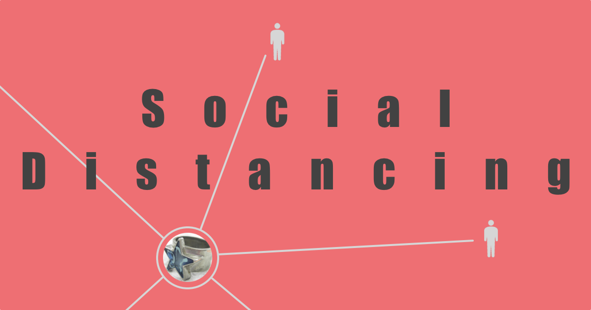
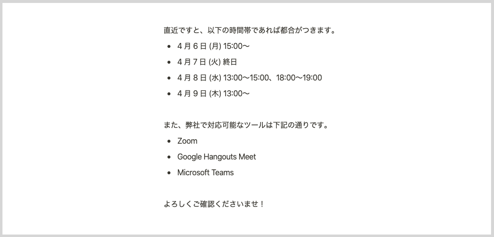

+++
date = "2020-04-05T18:00:00+09:00"
title = "Social Distancing と 2020 年"
description = "Social Distancing を自分なりに解釈できたので、どう捉え、どう受け止め、どうしていくつもりなのか書きました。"
slug = "social-distancing-2020"
og_image = "2020/04/05/social-distancing-2020/thumbnail.png"
draft = false
+++

2010 年代は、ソーシャルメディアが世に浸透した 10 年間だった。ブログや SNS の登場自体は 2000 年代前半だったが、それらが広く知られ、使われ、影響力を高めていったのが 2010 年代だった。「バズる」「インフルエンサー」「炎上」「ステマ」といった語彙たちが市民権を獲得していく過程を眺めていた。

この期間を経てぼくらは「誰かとつながること」を明示的に意識する人種になった。友だちになる、フォローする、友だち申請を承認する。あるいは、友だちを辞める、アンフォローする、ミュートする、ブロックする。アナログの世界ではやんわりとしたフェードアウトで表現されていたものが、今では意思をもって画面をタップして実行するものになった。タップじゃなくてスワイプかもしれないけれど。

「つながる」「つながり」を強く意識させられながら、あるいは、ネイティブ世代であれば意識するまでもない当然の感覚として組み込まれながら、ぼくらは 2020 年代に突入した。

### Social Distancing

そこでぼくらを待ち受けていたのは Social Distancing だった。耳慣れない言葉だ。しかも「ウィルスとの戦い」という意外な文脈の中から飛び出してきた言葉だった。

10 年をかけて Social Networking を叩き込まれたぼくらに与えられた次のお題が Social Distancing だというのは、なかなかの皮肉ではないか。

日本語に訳しながら意味を読み取ろうとすると「社会的に距離を置くこと」になるだろうか。あなたはどんな日本語訳をあてただろう。いずれにせよ、ピンとこないフレーズだとぼくは思う。

ようやく自分なりに解釈できるようになったのは、及川卓也さんによる <a href="http://takoratta.hatenablog.com/entry/2020/03/29/124204" title="不義理をしよう - Nothing ventured, nothing gained.">不義理をしよう - Nothing ventured, nothing gained.</a> のおかげだった。特に多くの視点を与えてくれた箇所を引用する。

>今回の感染症は飛沫感染と接触感染が主な感染経路と言われるが、避けるべきことは物理的な距離を一定以上に保つことだ。ならば、物理距離拡大とか物理距離確保、英語ならば、Physical Distancingとするべきじゃないか。

ぼくも同じ思考の過程をたどっていた。感染拡大を防ぎましょう、ということであれば物理的に距離を置くのがよさそうに思えた。

>冒頭の例で言うならば、送別会、退官記念、卒業祝いなど、こういった社会的な人と人との繋がりを物理的には行わないようにしようという呼びかけなのだろう。

なるほど、これらはたしかに「社会的つながり」に根ざしたものだ。

<blockquote>
今求められているのは、PhysicalにUnsocialになることだ。 
出来ればお会いしてお話ししたと言われても断る。 
握手を求められても断る。 
隣に座りたいと言われても断る。 
人付き合い悪くなろう。 
不義理になろう。
</blockquote>

この締めくくりを見て、Social Distancing について述べた記事のタイトルが「不義理をしよう」になった経緯を理解して感心してしまう。

「不義理をしよう」というメッセージから、Social Distancing を自分の感覚で考えるとっかかりを見つけたので、ここから書いていこう。

### アナログ世界の Social Distancing

アナログ世界の Social Distancing については、概ね及川さんの記事に同意である。

3 月末は区切りの時期ということもあって、お仕事でお付き合いのある様々な企業の人々から「退職のご挨拶」と題されたメールを何通か受け取った。そこにはだいたい「本来ならばお伺いしてご挨拶すべきところですが、」的な文言が含まれていて、これ自体は以前からそうだったけれど、今年は「現在の状況を鑑みて、メールでのご挨拶とさせていただきます」と新型コロナウィルス対応の特別バージョンという雰囲気があった。新型コロナウィルスを理由にすれば誰も「挨拶にこい！無礼者が！」と言えないので、無限の利便性がある。

ところで、ぼくの見立ててでは「本来ならばお伺いしてご挨拶すべき」と書いている人の半分以上は、別に伺って挨拶をする気はないと思う。なぜぼくがそう思うかというと、これまでの約 12 年間の会社員生活の中で経験した「オフラインご挨拶」と「オンラインご挨拶」では、後者の方が圧倒的に多いからだ。たとえば営業職の人から見た両者の比率はぼくとは違うものにはなりそうだが、職種によってまちまちになるのであれば「なにが本来なのか」と思わずにはいられない。きっと、本来なんてものはどこにもなくて、状況に合わせてメリットが大きい方が選ばれているだけだろう。

今のこの状況の中で「これはオンラインでもいけるじゃん」「むしろオンラインの方がいい」という作業の領域が次々に見つかっていることをぼくはよろこばしく感じている。今後は、お打ち合わせのための調整メールに「都合のいい時間帯」とあわせて「都合のいいビデオチャットツール」も列挙されるようになっていくのかもしれない。

### デジタル世界の Social Distancing

デジタル世界の Social Distancing は、Digital Wellbeing の文脈とともに語られるものだろうか。

いま、マスメディアが報じるニュースやソーシャルメディアに流れてくるあれこれに疲弊を感じているとしたら、適切に距離を置くことを検討してみるとよいだろう。メディアからの情報を受けてぼくらの体がウィルスに感染することはなくても、精神衛生上よろしくないコンテンツによって気分が害されたり精神的に不健康になってしまうことはよくある。ひとりひとりが護身術を身につけておくに越したことはない。

ぼくはたまたま 2018 年の後半くらいに「メディア疲れ」の兆候を感じることができたので、そのときに情報チャンネルの断捨離や通知設定の見直しを実施した。見ていて「ウッ」となるものを今後も見続ける義務はない。自分とは異なる考えを過度に避けようとして情報偏食気味になるのはそれでそれで危ないけれど、だからといって毒を飲むことはない。

まずは、情報をその性質で分類して整理しよう。

|     　　　 | 自分と近い考え | 自分と遠い考え |
| :--------: | :--------: | :--------: |
| 刺激が弱い |     A      |     B      |
| 刺激が強い |     C      |     D      |

ぼくは A と B をバランスよく摂取するように意識している。C や D によってハッとさせられることもあるが、振り回されることもあるので要注意だ。多くの人にとって厄介なのは C ではなかろうか。自分の考えや願望を肯定してくれるような力強いメッセージ。「そうだそうだ！」と身を委ねてしまいたくなるのもわかる。しかし、C ばかりを取り入れていては思考が先鋭化してしまうだろうし、視野が狭くなるリスクもある。

ここで読者のみなさんと共有しておきたいアイディアがある。それは「ある人と仲がよいか」と「その人のソーシャルメディア上の発信を受信したいか」は区別していい、ということだ。「いっしょに過ごすと楽しい」と「刺激の強い情報ばかりをリツイートするから困る」は両立する。ぼくがある人のツイートを見ないようにしていることは、ぼくがその人を嫌っていることを意味しない。ある人と付き合っていくときに、その人のすべてを愛して受け止める必要も義理もないのだ。

あなたが日常的に利用しているコミュニケーションツールについて、まずは通知設定を一通り見てみるとよい。不要だな、と思う通知はオフにしよう。なんだったらいったんすべてオフにしてみるのもよい。それから「この通知はオフだと困るな」と感じたものだけをオンに戻そう。見たくない情報は遮断しよう。除外ワードを設定してもいいかもしれない。ミュートだって活用しよう。あなたの心を守れるのはあなただけだ。

幸い、現行の iOS にも Android にも Digital Wellbeing を支援する設定がある。アプリ単位で「これは、1 日に 30 分までしか開けない」と制限して過ごしてみるのもおもしろいのでオススメしておく。

- <a href="https://support.apple.com/ja-jp/HT208982" title="iPhone、iPad、iPod touch でスクリーンタイムを使う - Apple サポート">iPhone、iPad、iPod touch でスクリーンタイムを使う - Apple サポート</a>
- <a href="https://play.google.com/store/apps/details?id=com.google.android.apps.wellbeing&hl=ja" title="Digital Wellbeing - Google Play のアプリ">Digital Wellbeing - Google Play のアプリ</a>

### まとめ

「つながれ」と繰り返し求めてきた社会が、今度は「はなれろ」と言ってきた。なんなんだよと思う気持ちもありつつ、それでもぼくらは「わかりやした」と返事をしてやっていくしかない。突きつけられた課題はあまりにも巨大で難解だけれども、ぼくらが「他者とのつながり」「社会とのつながり」を本気で見つめ直すまたとない機会にもなっている。適切で、健全な、心地よい距離を見つけていこう。

2019 年 4 月、ぼくらは「令和フィーバー」のリズムに合わせて踊っていた。新元号は日本にお祭り騒ぎをもたらしてはくれたものの、相変わらず平成からの慣習──昭和と言った方がいいかもね──を捨てられない「変われない社会」を可視化した面もある。

そして今は 2020 年 4 月。改元が変えられなかったものを、COVID-19 は変えてしまうのだろうか。少なくともぼく個人は、変化を余儀なくされていると感じる。「変わるか、変わらないか」ではなく「どう変わるか」を問われているように感じる。というか、もう変わっている。こんなことを考えて文章にする世界線を生きている。

アフターコロナのこの世界を、いい感じの距離感でともに生きていきましょう。
