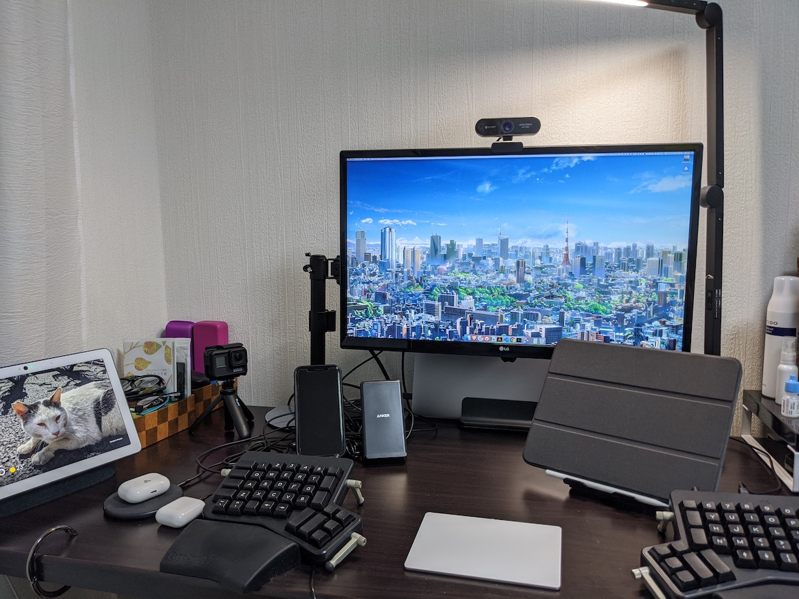

+++
date = "2020-05-24T15:00:00+09:00"
title = "教えてリモートワーク @june29 の場合"
description = "フィヨルドさんの企画「教えてリモートワーク」に誘っていただいたので、ぼくの分を書きました。"
slug = "tell-me-remote-work"
og_image = "2020/05/24/tell-me-remote-work/desk.jpg"
draft = false
+++

<a href="https://fjord.jp/" title="FJORD,LLC(合同会社フィヨルド)">FJORD,LLC(合同会社フィヨルド)</a> さんの企画「教えてリモートワーク」に誘っていただいたので、ぼくの分を書きます！

### お名前・お仕事・フィヨルドブートキャンプとの関係を教えてください。

大和田純と申します。ウェブ上では「june29」という源氏名で活動することが多いです。「GMOペパボ株式会社」(以下、ペパボ) に勤めています。

フィヨルドの <a href="https://twitter.com/komagata" title="Masaki Komagata (@komagata) / Twitter">@komagata</a> さん <a href="https://twitter.com/machida" title="machida (@machida) / Twitter">@machida</a> さんには 2012 年からお世話になっています。ペパボではソフトウェアエンジニアの研修の一部をフィヨルドブートキャンプにお願いしていて、エンジニアを預けるときにはぼくも研修の様子を眺める係を担当させてもらったことがあります。そんなつながりがあって、今回のインタビュー企画にもお誘いいただきました。

### ご自宅での作業環境を教えてください。

- MacBook Pro (15-inch, 2018)
- LG 24UD58-B (モニタ)
- ErgoDox EZ (キーボード)
- Magic Trackpad 2
- iPad Pro (11-inch)
- AirPods Pro

### 会社でのリモートワークについて教えて下さい。

はーい！

#### コロナの影響で会社の勤務形態はどのようになっていますか？

2020 年 1 月 27 日から全社的な在宅勤務体制となり、これを書いている 5 月 24 日現在も継続しています。もう丸 4 ヶ月近く会社のみんなで在宅勤務を続けていることになりますね。

#### コロナ以前の通常時の会社のリモートワークに対する仕組みはどのようになっていますか？

リモートワークの制度はありませんでした。ただ、東京・福岡・鹿児島と拠点は 3 ヶ所あって拠点をこえてのやりとりは毎日のように行うので、遠隔で協働するという意味での「リモート」には自然に対応していたと言えます。おかげで今の体制になってからもこれまで通りに済むことは多いです。

また、GMO グループは 2011 年に発生した「東日本大震災」以降、災害に備えた「在宅勤務訓練」を継続して実施してきました。毎年の訓練日には「業務システムにアクセスできません！」「自宅の椅子だと長時間の着座は厳しいです」と言った声がちょいちょいあがるのですが、その都度で改善を重ねてきて今があります。訓練なしでいきなりの全社的在宅勤務となっていたら大混乱に陥っていたことでしょう。備えが活きましたね。

グループの取り組みについての詳細はこちら 
[緊急テレワ一ク1ヶ月目、GMO熊谷正寿代表に聞く『成功する在宅勤務』の秘訣（神田敏晶） - Yahoo!ニュース](https://news.yahoo.co.jp/byline/kandatoshiaki/20200228-00164862/)

さらに、ぼくの労働形態は「裁量労働」で、大きな裁量が与えられています。よりよい成果を出すために、たとえば「明日はミーティングの予定もないし、通勤にかかる労力を節約して自宅で集中して作業をもりもり進めます」と上長と進言して在宅勤務する日はこれまでもありました。「在宅勤務が許可されている」というよりは「成果のために裁量を発揮して働き方も提案することが期待されている」といった方が実態に近いと思います。

#### 良い点と難しい点

- よいと思うところ
  - 電車通勤による消耗がない
  - 疲れたときにお布団に入団できる
  - 家族と過ごせる時間が増える
- 難しさを感じるところ
  - 同僚たちとの雑談が減ってしまった
  - 自分はともかく、新しく入社した人々のことは心配している

よいところも難しいところもけっこうわかってきたので、COVID-19 な状況が落ち着いたら「週に 1 〜 2 日くらいオフィスに行く」日々を試すつもりです。多くの物事は 0 か 1 かの極端な二択ではなくその間にちょうどいい塩梅があるものです。「週 0 日」「週 5 日」の間にちょうどいい出勤の頻度があるんじゃないかと感じています。

### 作業環境でこだわっているところを教えてください。

こだわり、あんまりないんですよねぇ。ふつうに暮らしている一般人です。

いちおう [https://scrapbox.io/june29/自宅の作業部屋のデスクまわり](https://scrapbox.io/june29/%E8%87%AA%E5%AE%85%E3%81%AE%E4%BD%9C%E6%A5%AD%E9%83%A8%E5%B1%8B%E3%81%AE%E3%83%87%E3%82%B9%E3%82%AF%E3%81%BE%E3%82%8F%E3%82%8A) に一通りの情報は載せてあって、これから作業環境を整備するぞって人なら楽しめるかもしれません。

### リモートワークでこれがあると便利！な物を教えてください。

かぶりもの…？

<blockquote class="twitter-tweet">
ずっと家にいるのも飽きてきて変化を求め始めた人間のイラストです <a href="https://t.co/vFKd5P3zUA">pic.twitter.com/vFKd5P3zUA</a>
&mdash; Jun OHWADA at 🏠 (@june29) <a href="https://twitter.com/june29/status/1227893382027964419?ref_src=twsrc%5Etfw">February 13, 2020</a></blockquote>

### ストレス解消方法はなんですか？

家庭においても会社においてもみなさんによくしてもらっていて、これで「ストレスが〜」とか言っていたらバチが当たりそうな幸せな毎日。ぜんぜんストレスのない人生です！やったね！

体を動かすと気分がスッキリするってのはあります。COVID-19 な状況で通っているフィットネスジムも閉館しているので、自宅で『リングフィット アドベンチャー』をプレイしています。

<iframe width="560" height="315" src="https://www.youtube.com/embed/9u_TLNhu4gY?controls=0" frameborder="0" allow="accelerometer; autoplay; encrypted-media; gyroscope; picture-in-picture" allowfullscreen></iframe>

リモートワークのストレスではなく「外出自粛のストレス」としては、お気に入りの飲食店に行けないことが挙げられます。食事はすべて自宅で済ませているので、たまに「外食したい！」って気持ちにはなりますね〜。仕方がないので、ぼくの地元である北海道の食を取り寄せて楽しむなどしています。

<blockquote class="twitter-tweet">
タコのシャブをキメています🐙 先日、初めて食べた妻が気に入りすぎたのでリピとなりました🔂<a href="https://twitter.com/hashtag/%E3%81%AA%E3%81%BE%E3%82%89%E3%81%86%E3%81%BE%E3%81%84%E3%81%A3%E3%81%97%E3%82%87%E3%83%91%E3%83%BC%E3%83%86%E3%82%A3?src=hash&amp;ref_src=twsrc%5Etfw">#なまらうまいっしょパーティ</a><a href="https://twitter.com/hashtag/%E4%B8%8D%E8%A6%81%E4%B8%8D%E6%80%A5%E3%81%AE%E3%81%8A%E5%8F%96%E3%82%8A%E5%AF%84%E3%81%9B%E3%82%B0%E3%83%AB%E3%83%A1?src=hash&amp;ref_src=twsrc%5Etfw">#不要不急のお取り寄せグルメ</a> <a href="https://t.co/qsSRpoLFLW">pic.twitter.com/qsSRpoLFLW</a>
&mdash; Jun OHWADA at 🏠 (@june29) <a href="https://twitter.com/june29/status/1252543697381552129?ref_src=twsrc%5Etfw">April 21, 2020</a></blockquote>

### これからプログラマーを目指す方、現在プログラマーを目指して勉強中の方へアドバイスをお願いします。

まず、別業界や別職種からの転生を目指しているみなさんに敬意を表します。新しいことにチャレンジする姿勢はいつだって尊いですもんね。すばらしいことだと思います。みなさんのその前向きな姿勢が、ハッピーな未来につながってほしいな〜と願っています。

続いてフィヨルドブートキャンプのキャンパー (と呼ぶのか？) のみなさんへ。学びの場として、よい場所を選びましたね！もちろん人それぞれ合う合わないはあるでしょうが、少なくとも @komagata さん @machida さんは悪意を持たずにフィヨルドブートキャンプを運営されていますし、いいことばっかり言って入会者を増やそうともしておらず誠実な態度で、現役で現場に身を置いているので知識や経験がホンモノです。最近はメンター陣の動きも活発で、これまで以上にいい感じのコミュニティになっていますね。

さて、みなさんはソフトウェアのことは好きですか？ぼくは大好きです！ソフトウェアに加えて、ウェブのことも大好きです。この時代に生まれてこれてよかったなぁとしみじみ思います。腕力が物を言う時代に生まれていたら、ぼくのようなヘナチョコ動物はだいぶ大変な目に合っていたでしょうし、早い段階で絶命していたと予想します。

ソフトウェアはぼくに「書き換える楽しさ」を教えてくれました。ソフトウェアはハードウェアに比べて変更のコストが低いという性質を持っています。これによって利用者による工夫の余地が大きくなります。ソースコードが公開されているソフトウェアや、エクステンション機構・プラグイン機構を持つソフトウェアであればなおのことです。ソフトウェアは、ぼくらに書き換えられるのを待っています。

ソフトウェア書きを通じてぼくは、ハックする精神を学びました。物事をハックする方法。物事はハックしてもよいのだという考え方。物事を上手にハックすると人々によろこんでもらえるという体験。ハックは、今ではぼくの価値観の一部にもなっています。なんでも疑ってみて、よりよい形を模索するのが好きです。

続いてウェブ。ウェブはぼくに「可能性のすばらしさ」を教えてくれました。ぼくが何気なく書いた言葉が、誰かに届く。ぼくが何気なく撮った写真が、誰かの目に留まる。ぼくにとっての日常は、誰かにとっての非日常で。ぼくの大好きなモノを、どこかの誰かも大好きだったりして。ウェブがなければ「ぼくひとりのこと」として閉じていたものが、世界につながり、可能性が開き、なにかが始まるきっかけになる。ぼくの人生の中で、いくつかの可能性は現実として具現化しました。だから今日もウェブへの感謝は尽きません。

…と書いてみたものの、アドバイスらしいアドバイスにはなりませんでしたね！厳しい！

料理がうまくなると、食生活が豊かになりますよね。現代のプログラミングにも似たようなところがあります。つくりたいソフトウェアがあるのか、就職・転職を目指しているのか、純粋な成長意欲なのか、目的はそれぞれとは思いますが、プログラミングは生活を豊かにしてくれるスキルなので、ぜひとも楽しみながら身につけていってほしいな〜と思います。

お互い、自宅で、楽しくがんばっていきましょう。

### あわせて読みたい

- [教えてリモートワーク komagataさんの場合 - FJORD,LLC(合同会社フィヨルド)](https://fjord.jp/articles/2020-04-11.html)
- [教えてリモートワーク 伊藤淳一さんの場合 - FJORD,LLC(合同会社フィヨルド)](https://fjord.jp/articles/2020-04-28.html)
- [教えてリモートワーク らいむさんの場合 - FJORD,LLC(合同会社フィヨルド)](https://fjord.jp/articles/2020-05-12.html)
- [教えてリモートワーク 櫻井さんの場合 - FJORD,LLC(合同会社フィヨルド)](https://fjord.jp/articles/2020-05-18.html)
