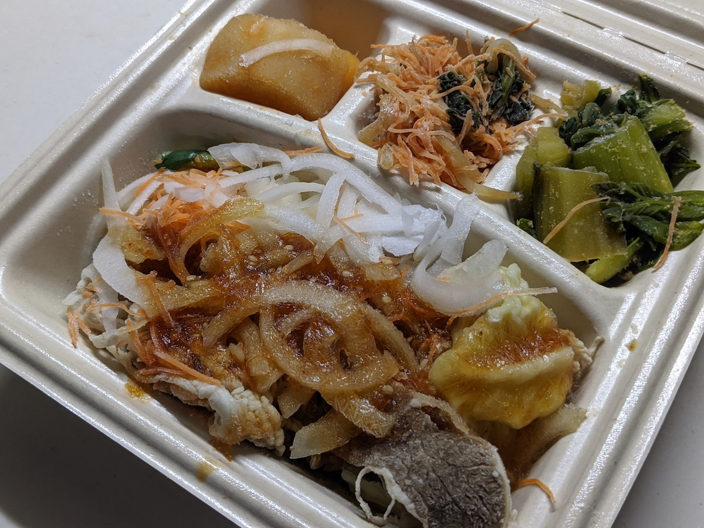
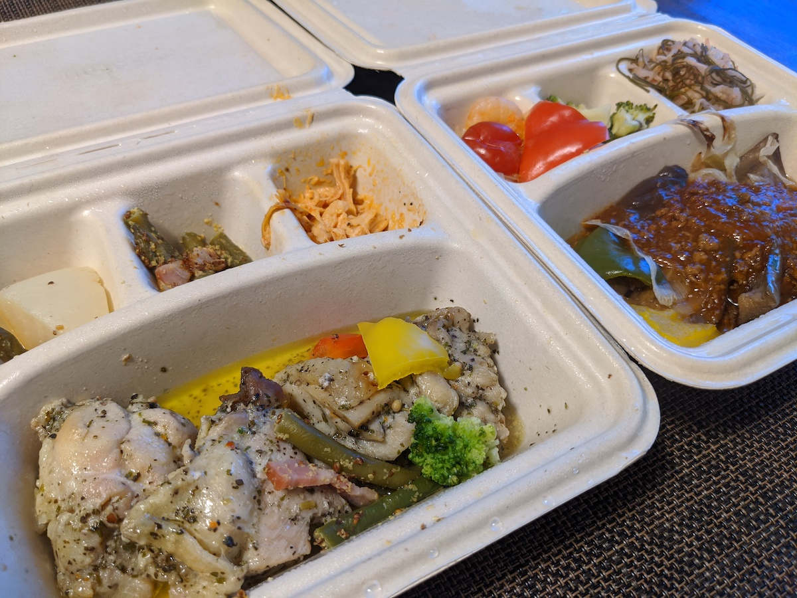
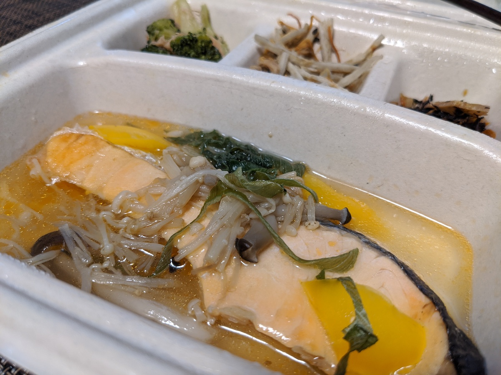
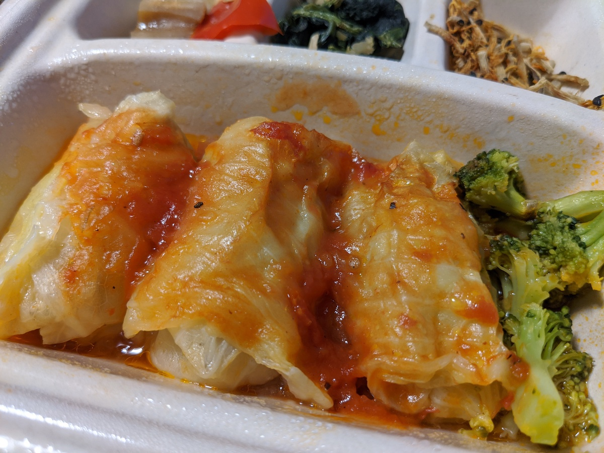
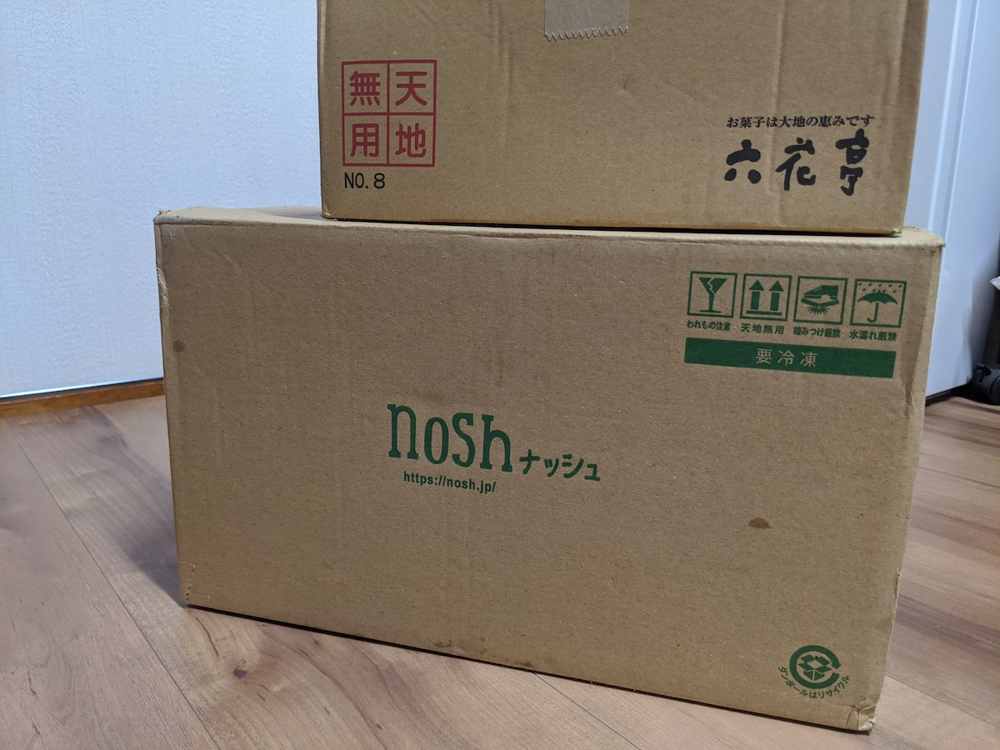
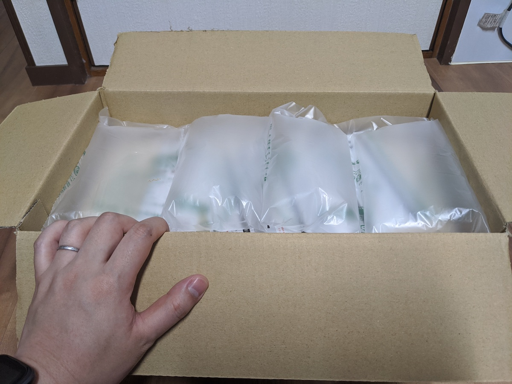
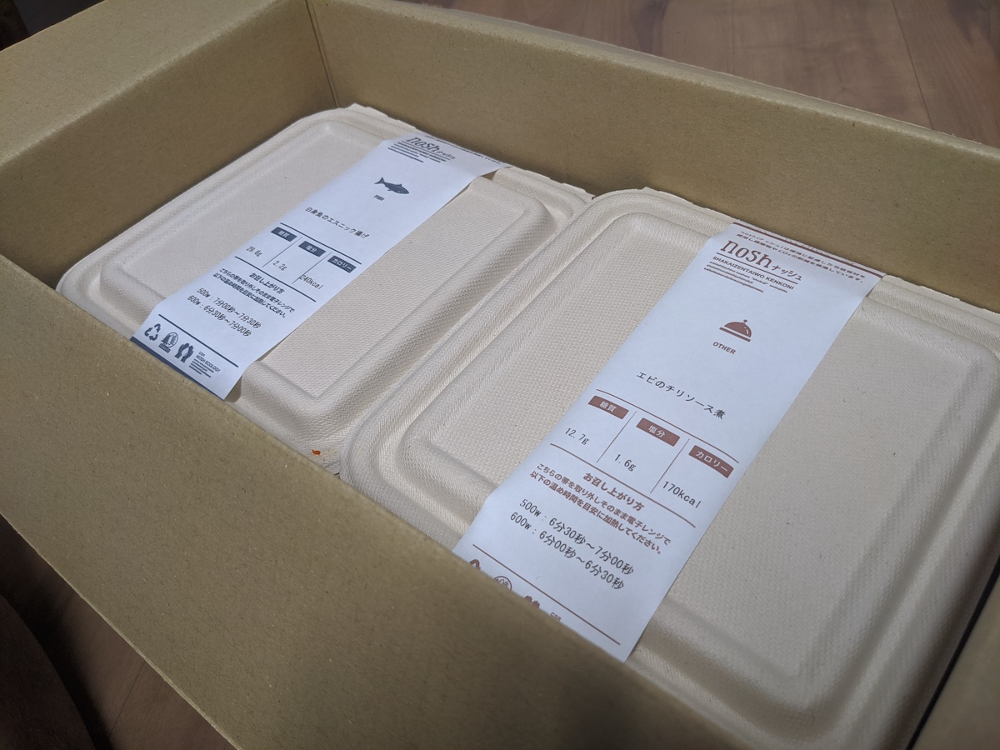
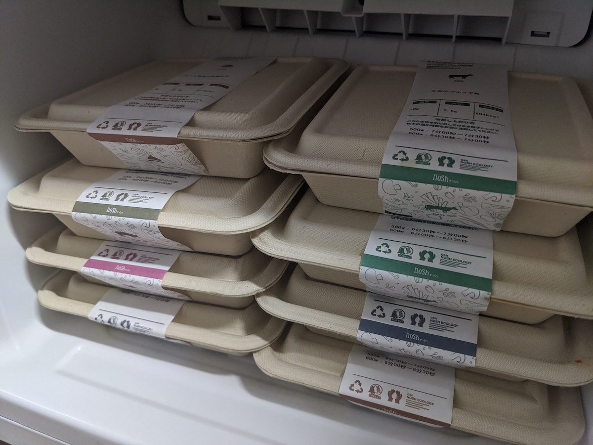
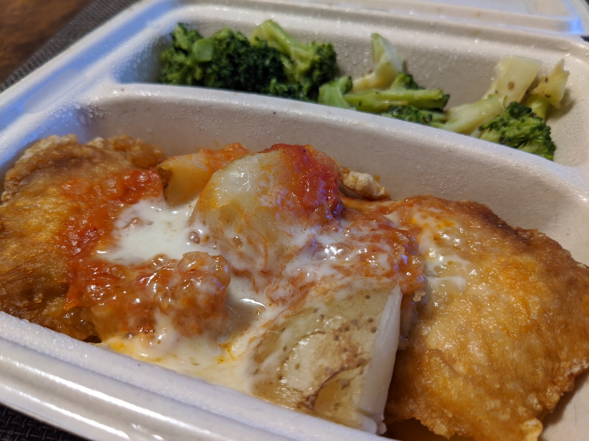

+++
date = "2020-07-06T23:00:00+09:00"
title = "ヘルシーな冷凍弁当宅配サービス「nosh」を利用している話"
description = "在宅勤務な今の状況にうまくマッチして継続利用している「nosh」の紹介記事です"
slug = "nosh"
og_image = "2020/07/06/nosh/nosh1.jpg"
draft = false
+++

<a href="https://nosh.jp/" title="【nosh-ナッシュ】ヘルシー・低糖質の食事宅配サイト">【nosh-ナッシュ】ヘルシー・低糖質の食事宅配サイト</a> の利用を始めてから 1 ヶ月以上が経ち、周囲に興味を持つ人が増えてきたので紹介記事を書くことにしました。

### どうが で しょうかい する よ

このさき、かんじもたくさんでてきますし、もじなんかよみたくないぜ、はなしてきかせてくれ〜というひとには、ぼくの Vlog で nosh についてはなしたかいがあるので、こちらをどうぞ！

<iframe width="560" height="315" src="https://www.youtube.com/embed/HwIxZNGVAcQ" frameborder="0" allow="accelerometer; autoplay; encrypted-media; gyroscope; picture-in-picture" allowfullscreen></iframe>

nosh こうしきのしょうかいどうがもあります。

<iframe width="560" height="315" src="https://www.youtube.com/embed/MbI8fQNydo4" frameborder="0" allow="accelerometer; autoplay; encrypted-media; gyroscope; picture-in-picture" allowfullscreen></iframe>

### 利用のはじまり

友人が「nosh いいぞ」と言及しているのを見かけて、ためしに注文してみたのが 2020-05-25 のことでした。プランは「6 食セット」「8 食セット」「10 食セット」とあるので、まずは最小の「6 食セット」を頼みました。食べてみてよさそうだったら継続するし、我が家に合わないようであれば 6 食だけ食べて解約すればいいので、気軽に注文しました。

2020-05-30 には届いて、翌 2020-05-31 のランチに妻とふたりで実食しました。「おいしいじゃん！」となったのでその日のうちに「8 食を毎週」というプランを選んで設定しました。以降、毎週土曜日に 8 食を受け取る生活を今日まで継続しています。

これは初めて食べたときの写真。

### 我が家の状況

- 夫婦ふたりで生活している
- 2020 年 2 月以降、ほとんどの食事を自宅で行っている
- 「大和田家の持続可能な生活方針2020」というものがある
  - 「食事」「健康」「学習」「経済」「娯楽」「交友」「地域」という 7 つの軸について方針をまとめてある
  - 「食事」についてはなるべくおいしいものを食べる、自炊は重視しない、楽をするにこしたことはない
  - 「健康」については @june29 の健康診断結果がよくなるようにやっていく

この状況に nosh がマッチしたので継続利用しています。

毎週の平日が 5 日あるうち、4 日分のランチを nosh でまかなっています。在宅勤務をしている平日、ランチタイムの休憩に合わせて電子レンジで温めるだけで食事の用意が済んでしまうところが最高です。最近は「冷凍庫をあけて、いちばん上にあるやつを取り出して温める」くらいの運用になっていて、とにかく考えるコストがかからないところが気に入っています。

お昼になったら栄養バランスのとれた食事がポンッと出てくるという意味で、給食っぽさがありますね。

### 写真で紹介

毎週土曜日に受け取るダンボール箱です。六花亭の箱は、ぼくのバースデイに合わせて暴力的なおいしさのお菓子を注文したときのやつなので気にしないでください。

空気がたっぷり入っているので安心できます。

ジャジャーン。

冷凍庫、今はほとんど nosh 専用庫になっています。届いたときに格納して、あとは上から順に取り出して食べています。もっと大きい冷凍室のある冷蔵庫に買い替えて、nosh も 10 食セットで頼むのもありかもね〜と家庭内で話していたりもします。

### 興味を持った人へ

まずは 6 食からでも始めてみるのがおすすめです！気に入ったら継続しましょう。ぼくもよくわかっていないのですが、下記リンクから購入に行くと最初の 3 回の注文が 500 円引きになるみたいです！

https://nosh.jp/c/fPr92

ぼくが用意したリンクを踏むのが癪！という人は、アドレスバーに nosh.jp と打ち込むか、検索してたどりつくなどしてください。いっしょに nosh 生活していきましょう。

