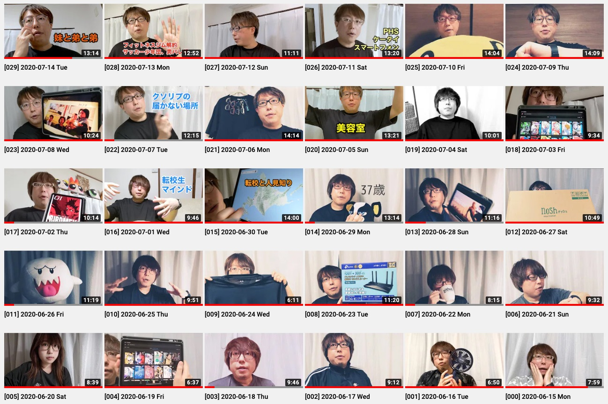

+++
date = "2020-07-18T21:00:00+09:00"
title = "Vlog を 1 ヶ月間やってみた記録"
description = "きまぐれにはじめた Vlog が 1 ヶ月間を通して途切れずに続いたので、現時点でのあれこれを書き記しておきます。"
slug = "vlog"
og_image = "2020/07/18/vlog/thumbnail.jpg"
draft = false
+++

2020 年 6 月 15 日に「やってみるか」となってなんとなく始めた Vlog が、途切れることなく 1 ヶ月間ほど続いたので今の心境や得られた気付きなどを記録しておきます。

https://www.youtube.com/channel/UClokd_QSKnZnqWgahuA4FLA/videos

### どうして始めたのか

友人が Podcast を始めたと教えてくれて、聴いてみたら楽しかったんですよね。もともと友人たちの日記やらブログやらを読むのが好きで、そこに「声」という要素が加わったメディアはおもしろいな〜と感じました。それで自分も「声色など、テンションも含めて記録しておけるような活動をしてみるか」と思い、試しに Vlog をやってみることにしました。

音声じゃなくて動画を選んだのは「なんとなく」です。もうちょっと考えてみると、自分はハードルの高さを「音声 > 動画 > 文章」と感じているかもしれません。音声だけのメディアより、映像もアリの動画メディアの方が気軽にコンテンツを生成できるような気がします。

### 運用方針

「とにかく気楽にやる」です。労力をかけない。がんばらない。機材はメインで使っているスマートフォンである「Pixel 4」と、スマートフォンも固定できる三脚、のみ。

一度だけ、Pixel 4 のストレージがフルになってしまって動画ファイルの保存に失敗し、撮り直した日がありました。それを除いたすべてが「一発撮り、そのままアップロードして公開」です。

やっていくうちに「今日あったことを話す回」と「トピックをひとつ決めてそれについて話す回」の 2 種類のパターンが発見されました。今のところすべての動画がどちらかのパターンになっています。

### 気付きや自分の変化や得たもの

約 1 ヶ月間ほどの Vlog 生活を経て気付いたこと、変化したこと、得たものを述べます。

#### (1) 自分のしゃべり方を変えていける

録音した自分の声を聴いてオゲゲーッとなったことのある人は多いかと思います。最初の 3 日間くらいは自分の Vlog についてもオゲゲ感が強くて、特に自分の「しゃべり方」が気に入らなくてちょっとずつ変えていきました。考えてみると、一般人 (？) の生活においては自分のしゃべり方についてフィードバックを得る機会ってそんなにありませんよね。Vlog 生活を始めてみると「毎日がフィードバック」という感じで、しゃべりを上達させていきたい人は Vlog をやるといいんじゃないかな〜って思いました。

ぼくは「こいつ、頭悪そうなしゃべり方しているな…」と感じるしゃべり方のクセみたいなものを発見したので変えてみました。言葉を探して選んでいるときに「いわゆる」「えーと、なんていうのかな」と言いがちなことにも気付いたけれど、こちらは変えずにそのままになっています。

#### (2) 動画がさらに身近になった

ぼくは 2019 年の春くらいから YouTube の動画を見て楽しむ機会が一気に増えて、お気に入りのチャンネルなんかも見つかって、動画が身近に感じられるようになっていきました。それから GoPro を購入してみたり、キャプチャーボードを購入してゲーム実況動画を撮ってみたり、動画をカジュアルに楽しむ習慣を身につけながら 2020 年を迎えていました。

今年はさらに動画と仲良くなってきた感触があります。ただこれは Vlog 生活の影響だけではなく、大オンラインコミュニケーション時代を生きているから、という背景もあるでしょう。社内のミーティングや友人とのオンラインでのやりとり、コミュニティイベントにおける登壇の場など、あらゆる場面で「動画撮影」「映像配信」の活用が本格化していると感じます。

#### (3) 人々と話す上で話のタネになる

ぼくの Vlog を見てくれた友人知人や同僚から声をかけてもらえることが何度もありました。感想を教えてもらえたり、お仕事のミーティングではちょっとしたアイスブレイクの材料になったりも。これは Vlog でも Blog でも同じですね。発信していると、相手が勝手にぼくのことを把握してくれていたりするのであれこれが捗って非常に便利だな〜と思います。

特に、ぼくの勤務先は「オフィスに出勤しない」という方針が基本となりましたし、友人知人たちともほとんど会うことなく暮らしている最近なので、自分から「生きている姿を見せる」ことの重要性は去年までと比べても高まっていると言えるでしょう。知ってもらえているというのは、多くの場面でプラスに作用します。

ちょうどそんな話をした回もあるので貼っておきますね！

<iframe width="560" height="315" src="https://www.youtube.com/embed/UVlWL5lDY3I" frameborder="0" allow="accelerometer; autoplay; encrypted-media; gyroscope; picture-in-picture" allowfullscreen></iframe>

#### (4) 外出自粛や在宅勤務とマッチした

ほとんど家の中で過ごす今の期間だから、毎日 Vlog を撮って公開する生活がマッチしたのかもな〜と思います。習慣があると日々にメリハリが生まれますし、Vlog の撮影開始前には「今日、なにがあったっけ？」と考えるので簡易なふりかえりの機会にもなっています。

オフィスに行ってお仕事をして退勤後に飲み会があってそれから帰宅して… という日だと、Vlog を撮るのは面倒になって寝ちゃいそうな気はしています。

#### (5) 撮影中、家庭が緊張モードになる

ぼくは自分の Vlog なので「よし、撮るぞ」と都合のよいタイミングで撮り始めますが、あるとき家族から「緊張モードになってしまう」というフィードバックをもらいました。「撮影中は音を立てないようにしていた」と聞いて、なるほど、それはそうかもと思いました。申し訳ないことをしました。一度、家族で撮影のポリシーについて話をして、それ以降は問題になっていません。またなにか気付いたら運用を改善するつもりです。

「ワシが撮影しとるんや、音を立てるなよ？」などと言うつもりはまったくなく、どんな音が入ってしまってもいいし、撮影中だろうと話しかけてもらってもオッケーとぼくは思っていました。しかし、たとえば「くしゃみの音を録音されたくない」というのはまっとうな欲求ですし、ぼくは「自分だったら平気」と思って鈍感すぎたので反省しました。

#### (6) YouTube の処理待ち時間、思っていたより長い

Pixel 4 のカメラで動画を 10 分間くらい撮影すると、だいたい 1 〜 2 GB くらいのデータになります。これを YouTube にアップロードするのに我が家の回線だと 2 分間くらいかかります。YouTube のサーバ上であれこれ処理されて再生可能になるまで、さらに 20 分間くらい待ちます。

YouTube の処理、ぼくがなんとなく想像していたより時間がかかるみたいです。なので、寝る直前に撮影すると、翌朝に目覚めてからの表示確認になってしまいます。

#### (7) Pixel 4 のストレージをがしがしと消費する

「そりゃそうだ」って感じですが、写真だけを撮って暮らす場合に比べると、何倍も早くストレージの容量を消費していきますね。容量がいっぱいになって動画ファイルが破損する、というトラブルを経験したので、これまでよりも空き容量に敏感になりました。デバイスに保存されている写真と動画を、適当なタイミングで削除するようにしています。

### こぼれ話

「どの服を着て撮影しようか」を考えるのが面倒になって、着心地のよいシャツを 4 枚そろえてひたすらそれを着る生活にしました。そしたら、Vlog の撮影だけじゃなくて生活そのものが楽になったのでラッキーでした。

ちょうどそんな話をした回もあるので貼っておきますね！

<iframe width="560" height="315" src="https://www.youtube.com/embed/73eulIWF5ek" frameborder="0" allow="accelerometer; autoplay; encrypted-media; gyroscope; picture-in-picture" allowfullscreen></iframe>

### 今後の展開

引き続き「とにかく気楽にやる」という方針は残したまま、下記のような展開を考えていたりします。

- 毎日更新ってのはどこかでやめる
  - 今も毎日更新と決めているわけじゃないんだけどたまたま更新が続いちゃっているので、もっとゆるくしたい
- Vlog 用に撮影機材を買い揃える
- 自分の映像と各種デバイスの画面を合成しながらしゃべりたい

撮影機材、Vlog を始めたときには「すぐやめるかもしれないしね〜」と思ってすでにあるものだけで済ませました。ここまで続いた (えらい) ので今後も楽しむためになにかしら買ってもいいかもな〜と考えています。

いま mmhmm の招待を待っているところで、これを使えるようになったら、カメラひとつで撮影するこれまでのスタイルとは別に、macOS 等の画面を映しながらしゃべるってのをやってみたいんですよね。ありもののツールの組み合わせでやれないこともないのですが、Vlog の運用に多大な時間は投じない方針なので、mmhmm を試すところから始めてみるってことでいいじゃろ、ってことにしています。

<a href="https://www.mmhmm.app/" title="mmhmm - Clear, compelling communication for everyone">mmhmm - Clear, compelling communication for everyone</a>

<iframe width="560" height="315" src="https://www.youtube.com/embed/c8KhKBLoSMk" frameborder="0" allow="accelerometer; autoplay; encrypted-media; gyroscope; picture-in-picture" allowfullscreen></iframe>

「動画の撮影、編集、ライブ配信」あたりって、これからファンダメンタルなスキルになっていくんじゃないかと予想しています。たとえばカンファレンスで登壇するシーンにおいて「PowerPoint や Keynote 等のスライドウェアを上手に使って良質な資料を用意できる」ってのはひとつの重要なスキルです。今後はこれに加えて「高画質な映像を配信できる」「資料に自分の姿を重ねて、身振り手振りも交えた発表映像を配信できる」といったスキルも重要になってきそうです。というか、すでにそうなっているとも言えますかね。

身近なところを見ても、先日に社内で開催された四半期報告会では、各部署の部長たちが「大事なことを言うとき、音声にエコーをかける」「クロマキー合成を駆使してメッセージをわかりやすく伝える」といった新しい技を繰り出していて、これから知見がどんどん共有されてみんなで上達していけそうだな〜とワクワクしちゃいました。

なのでぼくも、自分ひとりで自由にできる「june29 Vlog」という砂場を活用して、新しい映像様式に対応した人材となっておもしろいことをやっていけたらいいな、と思うのです。

### まとめ

というわけで、チャンネル登録よろしくおねがいします！それと、友人知人たちの Vlog をたくさん見たいので、Vlog をやっている人は教えてくださいね。相互チャンネル登録いたしましょう。

https://www.youtube.com/channel/UClokd_QSKnZnqWgahuA4FLA

### あわせて読みたい

- <a href="/2019/09/23/daily-diary/" title="人生で初めて「日記」や「日報」を書く習慣が定着したかもしれない - #june29jp">人生で初めて「日記」や「日報」を書く習慣が定着したかもしれない - #june29jp</a>
  - 日記も 1 ヶ月間ほど続いたところで記録していた
  - 今日まで途切れずに続いていてもうすぐ丸 10 ヶ月になる、Vlog はどうなるかね〜
