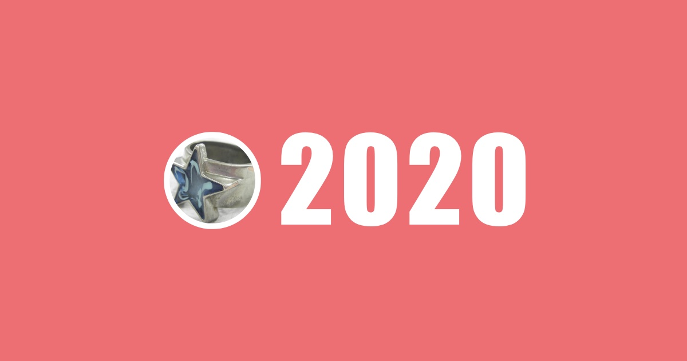
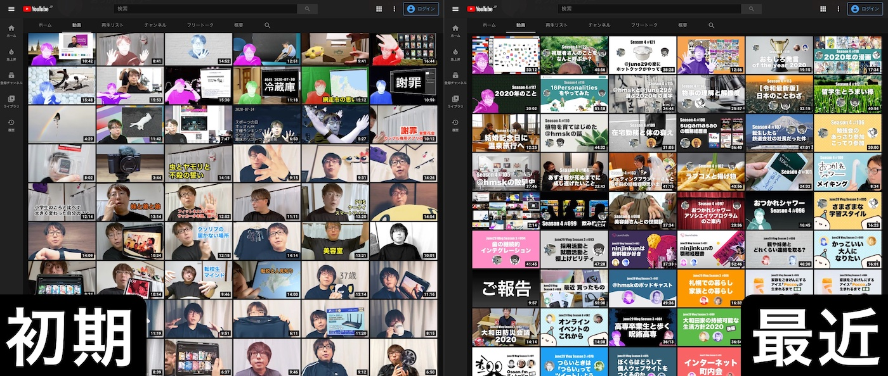

+++
date = "2020-12-31T17:00:00+09:00"
title = "ふりかえり 2020"
description = "日々の大部分を家の中で過ごした 2020 年のふりかえりを、やはり家の中から。"
slug = "2020-in-my-house"
og_image = "2020/12/31/2020-in-my-house/2020.jpg"
draft = false
+++

年末なので今年のふりかえりをやっていきます。成人してからはだいたい毎年「いや〜あっという間だったね〜」と言っている気はしますが、2020 年の「あっという間」感は例年よりさらに強かったように思います。そんな年だからこそ、ここで少し立ち止まって気持ちをダンプしておきたいですね。やってみましょう。

### ブログ

今年は 4 つしか投稿していません。直近でいうと 2017 年 21 件、2018 年 33 件、2019 年 27 件なので、2020 年はだいぶ少ないですね。ほとんどブログを更新しなかった年です。

去年から Scrapbox で書いている「日記」や、今年はじめた動画と音声によるアウトプットに活動の場所が移ったと言えるでしょう。詳しくは後述します。

- <a href="/2020/04/05/social-distancing-2020/" title="Social Distancing と 2020 年 - #june29jp">Social Distancing と 2020 年 - #june29jp</a>
- <a href="/2020/05/24/tell-me-remote-work/" title="教えてリモートワーク @june29 の場合 - #june29jp">教えてリモートワーク @june29 の場合 - #june29jp</a>
- <a href="/2020/07/06/nosh/" title="ヘルシーな冷凍弁当宅配サービス「nosh」を利用している話 - #june29jp">ヘルシーな冷凍弁当宅配サービス「nosh」を利用している話 - #june29jp</a>
- <a href="/2020/07/18/vlog/" title="Vlog を 1 ヶ月間やってみた記録 - #june29jp">Vlog を 1 ヶ月間やってみた記録 - #june29jp</a>

数は少ないながらも自分ではどの記事もけっこう気に入っています。「Social Distancing と 2020 年」は今年のぼくにしか書けないエッセイになったと思いますし、nosh の紹介記事はコンバージョンしまくって現時点で 27,500 円分のクーポンに化けました。

### 日記

<a href="https://scrapbox.io/june29/%E6%97%A5%E8%A8%98_2020" title="日記 2020 - 29box">日記 2020 - 29box</a>

通年で 366 日間、毎日の日記のページをつくってなにかしら書き込んでいました。Scrapbox の Web API を使って、日記の中に登場することの多かったリンクのランキングを見てみます。

- リングフィット アドベンチャー : 108 回
- 新型コロナウィルスの感染拡大に備えた全社的在宅勤務体制 : 83 回
- 毎週土曜日は自宅のお掃除 : 49 回
- june29 vlog : 43 回
- project kt : 43 回
- お掃除 : 40 回
- slay the spire : 32 回
- 新型コロナウィルス : 27 回
- フィットネスジム : 26 回
- キマグレエフエム : 24 回

「リングフィット アドベンチャー」で運動した日は日記にも記録していたので、100 回以上もリンクされることになりました。「新型コロナウィルスの感染拡大に備えた全社的在宅勤務体制」というのは、緊急で始まった 2020-01-27 からの全社的在宅勤務体制の記録をつけようと思い、最終的には 2020-05-29 までの 81 営業日分の記録となりました。

「Slay the Spire」というゲームを熱心に楽しんでいたことも記録されていて「そうそう、そうだったな」と思いました。

<iframe width="560" height="315" src="https://www.youtube.com/embed/gDX4YOY6ESA" frameborder="0" allow="accelerometer; autoplay; clipboard-write; encrypted-media; gyroscope; picture-in-picture" allowfullscreen></iframe>

### おつかれシャワー

2020-06-15 に「june29 Vlog」と名付けた活動を始め、定常的に動画を投稿するようになりました。2020-11-09 には「おつかれシャワー」という名前に更新して、この年末まで活動が続いています。ぼくにとっては今年の一大トピックです。約半年間で 127 本の動画をアップロードしました。自分でもびっくりする量です。

https://www.youtube.com/c/OtsukareShower

動画投稿の副作用でサムネイル画像づくりが少し上達したのがおもしろかったです。これまで画像編集ソフトはほとんど触れてこなかったのですが、簡単な編集くらいなら心理的な抵抗を感じずに挑戦できるようになってきました。

### キマグレエフエム

<a href="https://twitter.com/r_takaishi" title="🌻 ryo takaishi🌻 (@r_takaishi) / Twitter">@r_takaishi</a> さんに声をかけてもらって「キマグレエフエム」という Podcast を始めました。

<a href="https://anchor.fm/kimagurefm" title="キマグレエフエム • A podcast on Anchor">キマグレエフエム • A podcast on Anchor</a>

今日までに 44 個の音声コンテンツを投稿していて、おつかれシャワーと並んで 2020 年のぼくの発信チャンネルのひとつとなりました。

### 運動

2019-01-06 に契約して活用していたフィットネスジムを、2020-07-13 に解約しました。自宅からも近くて気に入っていたものの新型コロナウィルスの感染リスクを考えると妥当な判断だったと思います。

発売日に購入して 2019 年の一時期だけプレイしていた「リングフィット アドベンチャー」を 2020-04-14 から再開して、そのまま年末まで週に 2 〜 3 回はプレイする習慣を維持できました。今後も自宅内でこなせる運動を継続していくことになりそうです。

<iframe width="560" height="315" src="https://www.youtube.com/embed/-znJ0SvtGKw" frameborder="0" allow="accelerometer; autoplay; clipboard-write; encrypted-media; gyroscope; picture-in-picture" allowfullscreen></iframe>

### 食事

2020-05-31 から nosh を利用しています。ここから揚げ物を食べる機会が減り、野菜をとる量が増えました。在宅勤務で STAY HOME な状況だったので「自宅で楽しめる」「楽に準備できる」という要素を満たしているところがマッチしました。

2020-12-15 には「ヘルシオ ホットクック KN-HW24F」が導入され、直近 2 週間ほどは自分たちでつくった料理を口に運ぶ機会が一気に増えました。

以前のように外食を楽しめるようになるまでにはしばらくかかるでしょうから、来年も「おいしく、無理なく、楽しく」を自宅内で成立させられるようにやっていくつもりです。

<iframe src="https://anchor.fm/kimagurefm/embed/episodes/16-ek7o66/a-a3c380f" height="102px" width="400px" frameborder="0" scrolling="no"></iframe>

<iframe width="560" height="315" src="https://www.youtube.com/embed/rPwe2etSGko" frameborder="0" allow="accelerometer; autoplay; clipboard-write; encrypted-media; gyroscope; picture-in-picture" allowfullscreen></iframe>

### 交友

オフラインで会った友人は 10 人にも満たないくらい、こんな年は初めてです。家の中に妻がいることもあり、明確に「さみしい」「かなしい」と感じたことはなかったように思います。ただ、先述の「おつかれシャワー」にゲストを呼んでお話相手してもらったり、Podcast の「キマグレエフエム」で定期的に雑談したりといった機会はあり、無意識に人々とのやりとりを求めていたところはあるのかもしれません。

今後しばらくは、感染リスクを伴わない形での交友を模索していくことになりそうです。

### お仕事

今年の 3 月末にそれまで所属していた部署が消失し、場合によっては宙ぶらりんになりそうな状況を迎えていました。会社がぼくを持て余すようなことになるんだったら潔く退職ってパティーンもあるかもなあ、と考えたりもしていました。「会社としてはこういう選択肢があるよ」と提示してくれたものがどれも魅力的だったので、そのうちのひとつを選んで引き続き今の会社でのお仕事を続けています。なので 4 月には「異動」ということになり、新しい部署でがんばる日々がスタートしていました。

新しい部署でのお仕事については「うまくやれたよ〜」ということも「もっと結果を出さんとなあ」ということもあり、2021 年に向けて英気を養っている今です。幸い、新しい現場なので「飽きる」ようなことはまったくなく、楽しく過ごせていてありがたいです。

変化に強い会社に勤めていることで、今年は本当に助かったな〜と思います。社会の危機感が本格的に高まり始める前の 1 月末から在宅勤務を指示してもらえたことで、ぼくも、もっといえば家族も、じゅうぶんな感染予防策を講じながら安心して働き続けることができました。感謝しています。

### まとめ

社会が大きく変わっていく中、それなりにうまく自分なりの新しい生活様式を見つけて、順応できたんじゃないかな〜と思っています。過度に不安になりすぎることもなく、変化を楽しむつもりで YouTube への動画投稿などの新しいことも始めてみました。

ただ、こうして年末を迎えてみると「なんとか楽しむように」と自分に言い聞かせながら過ごしていたところがあるようにも思います。職を失う心配も収入が激減する心配もそれほどなく、自宅という安全な場所で活動を継続できているラッキーな立場の自分は、泣き言なんて言ってはいけない。そんなプレッシャーが少なからずあったのかもしれません。

通勤がなくなり、それに伴って読書の習慣が大きく損なわれました。新しいことをじっくり学ぶ時間はあまり取れませんでした。時間を取れなかったというか、落ち着いて学ぶ心のモードをつくれなかったというか。5 月から 6 月のあたりは、やけに眠い時期もあったりして、あまり生産的に過ごせなかったりもしました。目に見えないくらいのレベルで、じわじわと心が摩耗していたような気もしています。

2020 年 12 月は、まあまあ心を落ち着けて過ごせました。ようやくこの日々に慣れてきたと言えるでしょうか。とはいえ、今日の東京都内の新型コロナウィルスの新規感染者数は過去最高の 1,300 人をこえてしまって、ぼくらもさらなる社会の変化に飲み込まれていくかもしれません。自分にできることは多くはありませんが、せめて自分と家族の心の平穏くらいは守れるように、未知のものは正しく適度に恐れながらうまくやっていきたいです。

書き出してみて、気持ちを整理できたと思います！

今年もたくさんの人々にお世話になりました。どうもありがとうございました。来年もどうぞよろしくお願いいたします。よいお年を〜！
