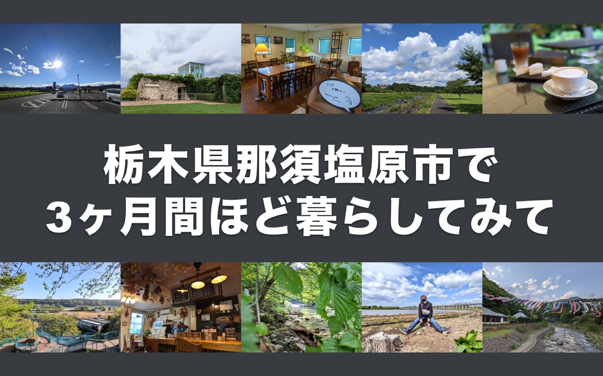
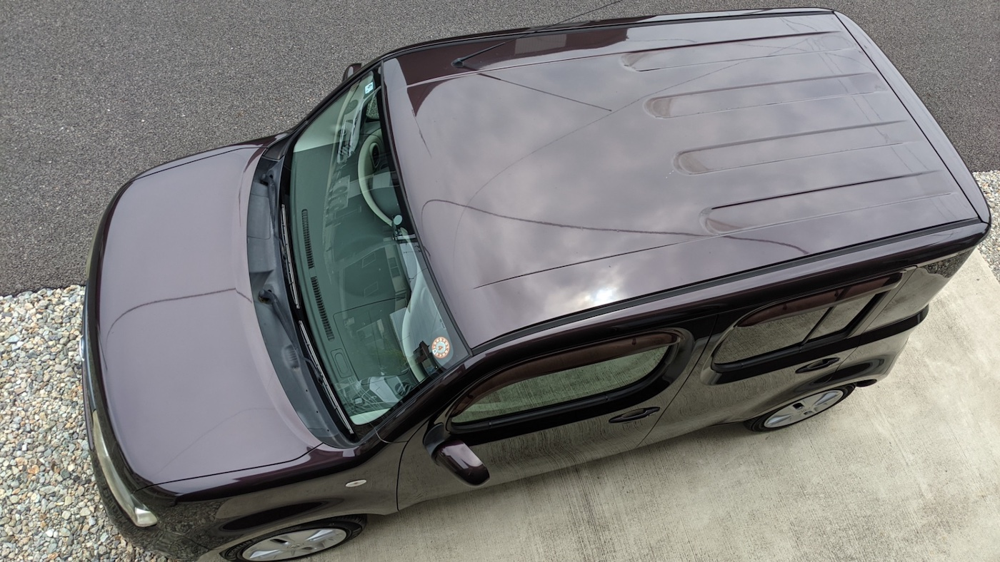
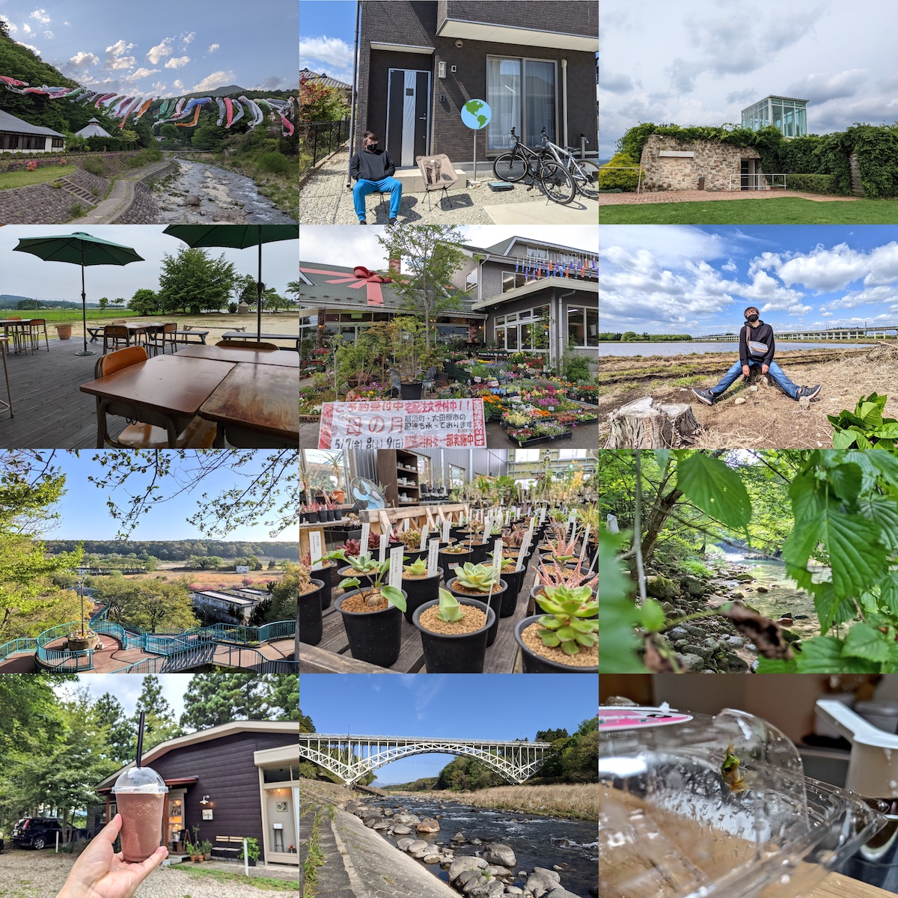
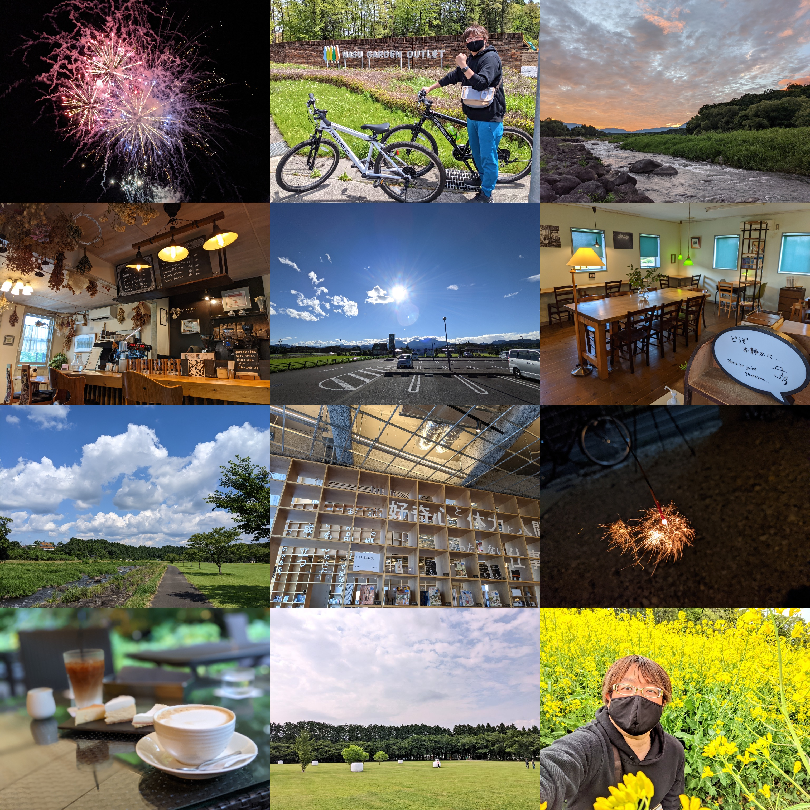

+++
date = "2021-08-10T22:00:00+09:00"
title = "栃木県那須塩原市で3ヶ月間ほど暮らしてみて"
description = "2021年4月に、東京都葛飾区から栃木県那須塩原市に引っ越しました。新しい暮らしがどんなもんかお伝えします。"
slug = "tochigi-nasushiobara-3months"
og_image = "2021/08/10/tochigi-nasushiobara-3months/thumbnail.jpg"
draft = false
+++

### はじめに

2021 年 4 月 22 日に、栃木県那須塩原市に引っ越しました。暮らし始めてから 3 ヶ月以上が経過したので、ここらで今の気持ちを記録しておこうと思います。試用期間が終わって、正式に栃木県民・那須塩原市民だ！

### タイムライン

今回の引っ越しに関連しそうなできごとを簡単にまとめました。

|時期|できごと|
|:---|:-------|
|2018|2020 年の夏は東京を離れて過ごしたい、と思い始める|
|2019 夏|[北海道で3週間ほど過ごした2019年の夏 \- \#june29jp](https://june29.jp/2019/08/11/staying-in-hokkaido-2019-summer/)|
|2019 秋|北海道に続いて、2020 年は福岡滞在を試してみようと思って飛行機や宿を手配する|
|2020|COVID-19 の影響で福岡滞在の予定はキャンセルとなり、ひたすら葛飾区で STAY HOME|
|2021-03-06|2020 に東京都内から那須塩原市に引っ越した友人に話を聞かせてもらう|
|2021-03-12|那須塩原市の物件をいくつか見てまわり、そのうちのひとつを選んで契約を進める|
|2021-04-18|[「新小岩ラプソディー」Music Video \- YouTube](https://www.youtube.com/watch?v=gxh8JYf8wC0) を公開する|
|2021-04-22|東京都葛飾区新小岩の家を出て、栃木県那須塩原市に入る|
|2021-04-23|那須塩原市役所に転入届を提出する|
|2021-05-23|中古車屋さんに行って車の購入手続きをする|
|2021-06-12|自家用車が納車される|

### 栃木県那須塩原市を選ぶまで

ぼくは北海道出身、妻は東京都出身で、栃木県には縁もゆかりもないぼくたちでした。引っ越しの 2 ヶ月前の時点では、自分たちが住む場所としての栃木県は候補にもあがっていませんでした。ただ、もともと「どこかのタイミングで東京を離れそう」という気配はあって、2018 年くらいから少しずつ具体的な想像を始めて、北海道札幌市や福岡県福岡市には目をつけていました。というか、今も目はつけています。

COVID-19 の影響で 2020 年をずっと東京都葛飾区の自宅周辺で過ごしていたら、さすがに飽きてくる感覚があって。年が明けて 2021 年、2 月くらいに妻がたまたま「コロナ移住！北関東特集」みたいな雑誌を目にする機会があり、それで「友人が那須塩原市に引っ越したから、話を聞いてみようか」となりました。

東京都と比べてしまえば他の都道府県はどこも「田舎」になるというか、都会度は下がりますよね。ぼくは幼少期を北海道内の市町村で過ごしていましたし、虫も平気だし、どこに住むとしてもそれなりに順応できる自信はありました。妻にとっては、東京都の外は旅行などで訪れることはあれど住む場所としては未知の要素が多く、引っ越しを考えるにしても「住んでみたら、やっぱり合わなかった」となるリスクはあると考えていました。

那須塩原市の市街地はそれなりに栄えていてお店もたくさんありますし、先輩移住者の話を聞いてみると「そんなに不便じゃなさそう」と思えました。また、東京都からそう遠くない点がよかったです。東京都から出るにしてもやっぱり戻るにしても、引っ越しが陸路で 1 日で住むのは我々にとって好条件でした。

### 住んでいる家

- 2015 年に建てられた賃貸物件
- 3LDK の 2 階建ての一軒家
- 月々の家賃は約 80,000 円
- 車 2 台を停められる駐車スペースあり

けっこう新しくてきれいだし、陽当たりがよいし、夫婦ふたりで暮らす分にはとても広いし、間取りも気に入っているし、本当に快適に暮らしています。東京感覚のぼくらからすると家賃は安すぎて鼻血が出そうです。

<blockquote class="twitter-tweet">
新居〜〜〜🥰 <a href="https://t.co/syvZRAJcYA">pic.twitter.com/syvZRAJcYA</a>
&mdash; Jun OHWADA 🚿 (@june29) <a href="https://twitter.com/june29/status/1385100998419443714?ref_src=twsrc%5Etfw">April 22, 2021</a></blockquote>

### 住んでいる地域

駅でいうと JR の黒磯駅が最寄りになる場所に住んでいます。いわゆる「黒磯」と呼ばれる地域です。くろいそ。黒磯は那須塩原市の中でもおしゃれな場所として売り出していこうとする雰囲気があります。

ぼくはあまりおしゃれエリアには立ち入らないので素朴に暮らしているのですが、那須塩原市のお隣の大田原市で牧場を運営している紗栄子さんの YouTube チャンネルに黒磯をお散歩している動画がアップされているので紹介しておきます。これを見れば黒磯のおしゃれエリアの雰囲気がなんとなくわかるでしょう。

<iframe width="560" height="315" src="https://www.youtube.com/embed/AKk9fXTkAuI" title="YouTube video player" frameborder="0" allow="accelerometer; autoplay; clipboard-write; encrypted-media; gyroscope; picture-in-picture" allowfullscreen></iframe>

<iframe width="560" height="315" src="https://www.youtube.com/embed/fyeZR8dmnQ4" title="YouTube video player" frameborder="0" allow="accelerometer; autoplay; clipboard-write; encrypted-media; gyroscope; picture-in-picture" allowfullscreen></iframe>

### 生活の様子

スーパーマーケットやドラッグストアが徒歩 10 分圏内にあり、ふつうに生活していく分にはなにも困りません。コンビニエンスストアも歩いて 10 分くらいのところにあります。妻といっしょにお散歩がてらお買い物するような日々です。ファーストフードを含む飲食店は、徒歩 30 分圏内にだいたい 30 件程度でしょうか。これは東京都内と比べるとずいぶん少ないですよね。

自転車があると行動範囲は少し広がります。ぼくは家の前に停めてある自転車をスッと走らせてスーパーやコンビニに行くのはとても気に入っています。ただし、自転車で快適に走れないような道もけっこう多くて、すぐ横を自動車がばんばん通るような道を自転車で移動するのは危ないので控えています。「自転車で市役所に行くなら、このルートで行くといちばん走りやすい」みたいに、自転車での最適ルートを少しずつ見つけていくのは楽しいといえば楽しいです。

### 自家用車を手に入れてから

とにかく「車社会ですよ」「車がないと」と言われまくるわけですが、最初は自家用車なしで生活してみていました。実際のところ、多少の不便はあっても車なしで生活することはできると思います。「車は必要か？」と問われれば NO と答えるけれど「車があるとよいですか？」と聞かれたら YES です。あると生活がとても楽しくなるので、あった方がよいと思います。中古車屋さんで適当に選んで、初期費用は 65 万円くらいかかりました。いい買い物だったと思います。

自家用車のある休日は、那須塩原市と近隣の市町村のよさげなスポットを巡る日になります。車を 30 分も走らせれば、公園、牧場、渓谷、道の駅、飲食店、カフェなどなど、数え切れないほどのよい場所にたどりつけます。また、ウェブ上にいい感じにまとまったスポット情報というのがあまり見当たらなくて、とりあえず行ってみると「最高じゃん…」となる場所があるので楽しいです。

### カウントダウン生活

栃木県那須塩原市での暮らしは、ぼくたちにとっては「カウントダウン生活」という活動の一部という位置付けです。この間まで住んでいた東京都葛飾区も、その前に住んでいた東京都大田区も、引っ越しが決まって「ここで暮らすのも、あと 30 日か〜」と残り日数を意識するようになると、密度の高い時間を過ごすようになっていました。

そこでぼくたちは、引っ越し直前の高密度に楽しい時間を日常のものにしようと「よく知らない地に引っ越して 2 年間だけ住んでみる」というコンセプトを考え、これをカウントダウン生活と名付けました。今のところの計画では 10 年間で日本国内のあちこち 5 ヶ所に住んでみたいと思っています。今年 38 歳になったぼくですが、足を踏み入れたことのない都道府県がまだたくさんあります。カウントダウン生活をやっていく中で、なるべくすべての都道府県を見てまわりたいです。

日本中のあれやこれやを自分たちの五感で感じ取って、自分たちはどんな場所でどんな時間を過ごしているときにハピネスを感じるのかをたくさん発見して、そんな日々を経てから老後の住処を選びたいと考えています。

### グッドやバッド

いったん 3 ヶ月経過時点での感想などを書きます。時が経てばまた変わってくる要素もあると思います。

- 総合的に見て「大満足」「引っ越してよかった」で、困りごとがちょっとだけある感じ
- 賃貸といえば集合住宅という先入観があったけれど、一軒家は快適でとてもよい
- 在宅勤務人間たちなので、作業部屋を確保できる間取りはとてもよい
  - 1 階のリビングと 2 階の作業部屋だと、音が干渉しない点もよい
- 自家用車のある暮らしというのを体験していて、これがとても楽しい
  - ぼくが普通自動車運転免許を所持していてよかった
  - 妻はけっこうドライブが好き、というのは発見だった
- 虫などの野生生物はけっこういて、妻にとってはストレスの一因になっている
  - 自宅の近くに田んぼがあって、6 月あたりは夜になるとカエルの大合唱が聞こえてくる
  - 家の中でカエルが発見されたこともあった (妻はカエルは平気だったからよかった)
  - 家の外壁にツバメが巣をつくってしまった
- キャッシュレス決済に対応しているお店が意外と多くて助かっている
  - 「支払いは現金メインかもな〜」と思っていたのでうれしい誤算
  - 体感で 8 〜 9 割のお店がキャッシュレス決済に対応している
  - PayPay で払える飲食店が多い、Suica を使えるお店もけっこうある
  - あるカフェで「Visaのタッチ決済」を指定したら「これを指定した人は初めてです」となった
  - 那須塩原市、いわゆるリゾート地だからなのか…？
- わりと新しく拓かれた場所に家が経っている地域っぽくて、幅を利かせている人がいなくて楽
  - 引っ越してきてすぐにあいさつまわりはしたものの、ご近所付き合いはほとんどない
  - いつも畑をいじっているご近所さんは収穫があるたびに作物をくれてありがたい…！
- 美容室や歯医者は、電話予約しか対応していないところが多くて最初は困った
  - 結局、ウェブ予約に対応している数少ない候補の中から選んだので今は困っていない
- 病院が近くにはないので、もし通院が必要な状況になったらちょっと困るかもしれない
  - ぼくが元気なら車を走らせればいいけど、ぼくが病気・怪我をしたらタクシーを使うかなあ
- 暮らしが自然と連動している感じがして楽しい
  - 陽が昇ったら眩しいから起床する・陽が沈んだら暗くなるから寝る雰囲気になる、って感じで、生活が朝型にシフトした
  - 空が広くて、毎日だいたい欠かさずに空を見ては雲や山の形を確認するのがなんか楽しい (伝われ)
  - 近所の田んぼ、引っ越し当時は田植え前だった、最近は緑がすっと空に向かって伸びている、これから黄金色になるのが楽しみ
  - 今は緑を楽しんでいる景色も、秋になれば表情を変えそうだから巡るのが楽しみ
- 栃木県や那須塩原市の情報が自分のアンテナに引っかかるようになってきた
  - これまでは北海道と東京都の話をメインに気にしていたけど、そこに栃木県が加わって自分ごとの範囲が広がった感触
- 大都会・東京都を離れての生活に妻はなじめるのか…？は杞憂だった
  - なんだったらぼく以上に那須塩原市での生活を気に入っているので、試してみて本当によかった
  - 妻は「ここは 2 年と言わず、4 年いようよ」と言い出している
- 感染症が広まっているご時世において、那須塩原市くらいの人口密度の場所はよい
  - 人が密になっている場所が少なく、あまりナーバスにならずに牧場や渓谷などに遊びに行ける
  - もともと札幌市や福岡市のような地方都市をよく調べていたが、もうちょっと都市を離れてもいいかも

### おわりに

道民として生まれて、就職のタイミングで都民になって、今回の引っ越しで県民になったぼくの近況報告でした。ここまできたら府民にもなってグランドスラムを達成したいので、どこかのタイミングで京都府か大阪府にも住んでみたい気持ちです。

最後に、最近の暮らしの中のお気に入りの風景の写真を貼っておきます。

